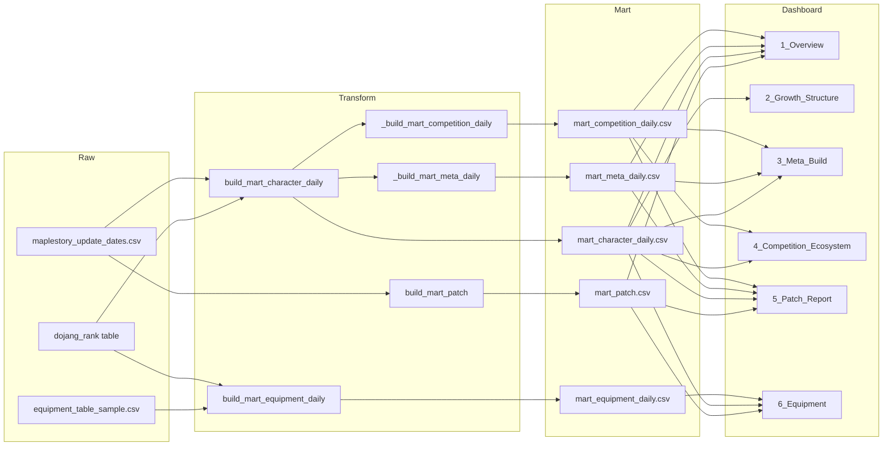

| Mart | **내용** | **업데이트 주기** |
| --- | --- | --- |
| **mart_patch** | 패치 내역 정보 | 패치 발생 시 업데이트 |
| **mart_character_daily** | 캐릭터 랭킹, 무릉 정보 | 일별 업데이트 |
| **mart_meta_daily** | 직업 랭킹 분포 정보 | 일별 업데이트 |
| **mart_competition_daily** | 직업 경쟁 지표 | 일별 업데이트 |
| **mart_equipment_daily** | 직업별 장비 분포 | 일별 업데이트 |
1. **mart_patch**
    - **Columns** : `patch_id`,`client_version`,`title`,`url`,`patch_date`,`patch_type`
    - **Source** : maplestory_update_dates.csv
        - 정규화, written_at → patch_date 파싱.
        - 동일 client_version 여러 행은 patch_date = min(written_at)으로 통합.
    - **활용**: 사이드바 패치 선택, 5_Patch_Report 패치 요약·유형·추천 액션, 6_Equipment 패치 전후 기간
2. **mart_character_daily**
    - **Columns**: `dt`, `character_id`, `job`, `sub_job`, `guild`, `ranking_type`, `world`, `rank`, `floor`, `record_sec`, `exp`, `power`, `exp_delta`, `power_delta`, `rank_delta`, `floor_delta`, `record_sec_delta`, `segment`, `patch_id`, `period_flag`
        - `rank`, `floor`, `record_sec` — 무릉 raw
        - `exp` — 지금은 NULL (추후 레벨*퍼센티지로 산출할까 고민)
        - `power` — 지금은 NULL (equipment_table에서 item_equipment (date, ocid)별 item_total_option__attack_power, __magic_power, __boss_damage, __ignore_monster_armor 등 숫자 컬럼 가중 합 고민)
        - `exp_delta`, `power_delta`, `rank_delta`, `floor_delta`, `record_sec_delta` — 전일 대비
        - `segment` (top/mid/bottom), `patch_id`, `period_flag` (pre/post)
    - **Source**: dojang_rank + equipment_table 집계 per (date, ocid).
        - 일별 정렬 후 character_id 그룹으로 delta 계산.
        - patch_date와 pre_days/post_days로 period_flag 부여.
        - 분위수로 segment 부여.
    - **활용**: 1_Overview KPI·Alert·직업별 랭킹, 2_Growth_Structure floor/record_sec 분포, 3_Meta_Build·4_Competition·5_Patch_Report 필터·집계 기반
3. **mart_meta_daily**
    - **Columns**: `dt`, `job`, `ranking_type`, `job_share`, `top_k_flag`
    - **Source**: mart_character_daily, dojang_rank
        - (dt, job, ranking_type)별 count → share, Top K 여부.
    - **활용**: 1_Overview Alert(메타 집중), 3_Meta_Build 직업 점유율 차트, 5_Patch_Report 메타 영향 문구
4. **mart_competition_daily**
    - **Columns:** `dt`, `ranking_type`, `rank_volatility` (std(rank_delta)), `gap_top_mid`, `entropy_meta`, `gini_job_share` (직업 점유율 Gini)
    - **Source**: mart_character_daily 집계.
        - 도메인 기법 반영 시 Gini 추가.
    - **활용**: 1_Overview KPI·Alert(격차 확대), 4_Competition_Ecosystem 변동성·격차·entropy 차트, 5_Patch_Report 경쟁 영향
5. **mart_equipment_daily**
    - **Columns**: `dt`,`job`,`equipment_slot`,`item_name`,`wear_count`,`share`
    - **Source:** equipment_table → date를 날짜만 추출,
        - equipment_list == "item_equipment"만 사용(프리셋 중복 제외).
        - Dojang(또는 이미 만든 mart_character_daily)와 (dt, ocid) 또는 (dt, character_name)으로 조인해 job 부여.
        - character_id가 ocid 기반이면 equipment.ocid로 조인.
    - **활용**: 6_Equipment 직업별 장비 점유율(슬롯·아이템별 %), 패치 전후 변동량(상승/하락 상위)