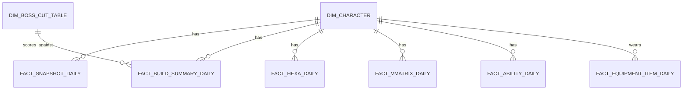

# 인벤 기반 메이플스토리 메타 분석 대시보드 지표 재설계 연구

## Executive summary

현재 대시보드가 **무릉(무릉도장) 랭킹을 중심 성과 축으로 두고**, 캐릭터 단위 데이터(스탯·장비·세트·어빌·헥사·하이퍼 등)를 수집하는 구조는 “가장 많이 보이는 성과 화면”을 잡는 데는 유효하지만, **인벤 커뮤니티가 실제로 ‘스펙/메타’를 논의하는 언어(환산·보스컷·방무/보공/벞지·유니온/링크·코강/헥사·스타포스/작 등)**를 충분히 반영하지 못합니다. fileciteturn1file0L15-L21 citeturn7view2turn21view2turn7view4turn16view0turn21view0

인벤 자료를 기준으로 보면 “메이플 특화” 지표는 크게 세 축으로 정리됩니다.  
(1) **벤치마크 성과(무릉/수로/딜표/보스컷)**, (2) **빌드의 핵심 상호작용 스탯(실방무·쿨감·공속·벞지·특수세팅)**, (3) **계정/성장 시스템(유니온·링크·V매트릭스·HEXA·스타포스·잠재/에디·작·포스)**입니다. citeturn3search0turn3search12turn21view2turn7view3turn21view0turn7view4turn16view0turn11view2turn11view4turn19view3

따라서 개선 방향은 “무릉 하나로 메타를 설명”하는 것이 아니라, **무릉을 ‘커트라인’ 관점의 분포·변화 지표로 유지하되**(인벤 내부 문서에서도 50층 커트라인 관점을 명시), **환산(스펙 표준화) + 보스 준비도(보스컷/배율) + 계정 시너지(유니온/링크) + 코어/6차(코강/헥사) + 강화(잠재/에디·스타포스·작) + 사냥(드메/마릿수)**를 “Maple-specific feature set”으로 재구성하는 것입니다. fileciteturn1file0L1-L21 fileciteturn1file1L16-L21 citeturn7view2turn21view2turn7view3turn21view1turn7view4turn16view0turn11view3turn19view4

가장 중요한 정리: **“임의 가중합 전투력(power)” 같은 범용 지표는 인벤 표준어(환산·실방무·커트라인·유니온/링크 등)로 교체**하는 것이 설명력과 신뢰도를 동시에 올립니다. fileciteturn1file1L5-L21 citeturn7view2turn21view2

## Research scope and current dashboard baseline

이 분석은 **인벤(inven.co.kr) 내 메이플 관련 팁/노하우 글, 자유·직업·질문 게시글, 인벤 게임뉴스(HEXA 등 시스템 정리 기사)**만을 근거로 “커뮤니티가 실질적으로 사용하는 스펙/메타 지표”를 추출했습니다. citeturn7view4turn7view3turn21view0turn16view0turn21view2turn11view3turn19view3

비교 기준(현재 대시보드/문서에서 확인 가능한 범위)은 다음 특징이 핵심입니다.

- **무릉을 중심 랭킹 지표**로 삼고(도달 층, 기록 시간 기반) 일자별 변화량(floor_delta)과 분포/분위수(P10/P50/P90)를 본다. fileciteturn1file0L27-L39 fileciteturn1file3L7-L20  
- “전투력(power)”을 공격력/마력/보공/방무 등의 **가중 합산 파생치**로 정의하고, power_delta로 성장 속도를 본다. fileciteturn1file1L5-L14  
- 메타 요약으로 직업 점유율(job_share), 엔트로피(entropy), 상위-중위 격차(gap_top_mid), 랭킹 변동성(rank_volatility) 같은 **통계 지표**를 둔다. fileciteturn1file1L22-L38 fileciteturn1file3L24-L41 fileciteturn1file0L23-L41  
- 장비 메타는 슬롯별 착용 점유율(share)과 패치 전후 점유율 변화(delta_share)를 본다. fileciteturn1file4L1-L24  

또한 내부 문서 관점에서 “무릉 50층이 커트라인이며, 상위권이 아니라 커트라인을 넘기는 지표로 보자”, “캐릭터 단위보다 직업군 단위로 보자”, “메이플에서만 존재하는 지표를 써야 한다”라는 방향성이 명시되어 있습니다. fileciteturn1file0L1-L19  

이 baseline은 “메타의 통계적 모양”을 보여주는 데는 강점이 있지만, 인벤에서 스펙을 이야기하는 핵심 축(환산·보스컷·실방무·유니온/링크·코어/헥사·강화 체계)을 충분히 모델링하지 못해 **왜 그런 변화가 관측되는지(원인 지표)**가 약해지는 문제가 생깁니다. fileciteturn1file1L5-L21 citeturn7view2turn21view2turn7view3turn21view1turn7view4turn16view0

## What Inven implies are Maple-specific measurements

인벤에서 “스펙 비교”가 다뤄지는 방식은 대체로 다음과 같습니다.

첫째, **환산(환산 스탯/환산 주스탯)**은 직업 간 비교를 위해 의도적으로 “장비창 UI 수치(장비/세트/펫세트/펫장비/전투복) + 헥사스탯”을 합산하고, 무기/보조무기 차이를 보정하는 식으로 **공통 비교 가능한 기준을 만들려는 시도**가 나타납니다. 이는 “임의 전투력”보다 커뮤니티 합의가 더 강한 표준어에 가깝습니다. citeturn7view2

둘째, **방무(방어율 무시)의 ‘실효(실방무)’ 사고방식**이 매우 강합니다. 무보엠 선택 가이드에서 “실방무 93~97”을 결론으로 제시하고, 고정 방무(직업/스킬/코강), 유동 방무(유니온/링크/도핑/하이퍼), 파티 시너지 등을 분리해서 조절해야 한다고 설명합니다. citeturn21view2 또한 저스펙/구간별로 “보스 목표에 따른 방무 기준선”을 제시하는 글도 반복적으로 등장합니다. citeturn0search3turn0search7

셋째, **유니온/링크는 계정 단위의 ‘메이플 고유 시너지 시스템’**으로 표준적으로 다뤄집니다. 유니온 공략에서는 TOTAL LEVEL 정의와, 점령 배치로 크확/보공/방무 등 효과가 나뉘며(바깥쪽/안쪽), 등급 체계가 존재한다고 설명합니다. citeturn7view3 링크 스킬은 “레벨 70부터 전수 가능, 120부터 2레벨”과 같이 시스템 자체가 정의되고, 최근에는 3레벨 조건/추가 효과가 (테섭 기준) 정리됩니다. citeturn21view0turn21view1

넷째, **코어 강화(V매트릭스)와 6차(HEXA)**는 “스펙의 큰 덩어리”로 취급됩니다. V매트릭스 가이드는 스킬코어/강화코어 개념, 25레벨(+슬롯5)로 30레벨까지 강화되는 구조, 강화코어의 “3줄 코어” 등 커뮤니티 용어를 명확히 설명합니다. citeturn7view4 HEXA 매트릭스는 인벤 기사에서 솔 에르다/솔 에르다 조각 재료, 헥사 스탯의 메인/에디셔널 구조, 선택 가능한 스탯군(크뎀/보공/방무/데미지/공마/주스탯), 강화 확률/재료 증가 등을 체계적으로 정리합니다. citeturn16view0turn16view2

다섯째, “성과 벤치마크”는 무릉만 존재하지 않습니다. 인벤에는 DPM/리레딜/40초딜 같은 표가 반복적으로 공유되고, 수로 점수나 펀치킹을 “딜 지표로 볼 수 있는가”에 대한 토론도 나타납니다. citeturn3search0turn3search8turn3search12

여섯째, 강화·경제 영역에서는 **잠재(큐브/등급 상승 확률), 작(주흔/피버타임/손재주/길드 스킬), 사냥(드메/마릿수/경험치·메소 계산)**이 별도 분석 주제로 성립합니다. 큐브 확률/등급 상승 확률은 공지 형태로 “등급 상승 확률”을 수치로 제시하며(예: 명장의 큐브 유니크→레전드리 확률 등), 작 가이드는 피버타임/손재주/길드 스킬이 성공률에 영향을 주고 30% 주흔의 기대 성공률을 조건부로 계산하는 식의 정량 논의가 나옵니다. citeturn19view3turn11view4turn10view1turn13view3 사냥 관련 글은 “도핑/사냥터/마릿수/시간” 입력으로 경험치·메소를 계산하고, 아획/메획의 한계효율까지 분석합니다. citeturn11view3turn19view4turn12view3

결론적으로, 인벤이 말하는 “메이플 특화 지표”는 단순 스탯 나열이 아니라 “시스템 간 상호작용을 반영한 요약치(환산/실방무/쿨감·공속·벞지/유니온·링크/코강·헥사/강화·사냥)”에 가깝습니다. citeturn7view2turn21view2turn7view3turn21view1turn7view4turn16view0turn11view3turn19view4

## Prioritized Maple-specific metrics to add

아래는 “대시보드에서 **직업군 단위**로도 집계 가능하고, 인벤에서 실제로 반복적으로 쓰이는 언어”를 기준으로 선별한 추천 지표입니다. 내부 문서가 제안한 “무릉 50층 커트라인/직업군 단위” 방향도 우선순위에 반영했습니다. fileciteturn1file0L1-L19  

표의 “인벤 데이터 가용성”은 (a) **정의·벤치마크 근거가 인벤에 있는가**, (b) **인벤 자체에서 구조화 데이터로 얻기 쉬운가(대부분은 게시글/표라 비정형)**를 함께 표기했습니다.

### Recommended metrics list

| 우선순위 | 지표 | 정의 | 필요 데이터 필드(예시) | 계산 방법(요약) | 인벤 근거/가용성 | Maple-specific인 이유 |
|---|---|---|---|---|---|---|
| High | 환산 주스탯(표준 스펙 지표) | 직업 간 비교가 가능한 형태로 스펙을 단일 수치로 표준화한 값(커뮤니티 표준어) | 장비창 UI 수치군(주스탯/주스탯%/공마 등), 세트효과, 헥사스탯, (무기/보조 보정) | “장비창 UI 수치 + 헥사스탯” 합산 후 무기/보조 보정 같은 룰을 적용(대시보드에선 ‘환산 값’과 ‘환산 분해(장비vs헥사)’를 같이 저장) | 인벤에서 “직업 간 유불리 없이 직관적 비교”를 위해 장비 UI 수치+헥사스탯 합산/보정 방식을 설명. (정의 O / 구조화는 게시글 기반) citeturn7view2 | 메이플은 장비/세트/헥사/코강 등 다층 시스템이 누적되므로, 단일 “스펙 표준어”가 없으면 직업/세팅 간 비교가 어려움 |
| High | 무릉 50층 커트라인 달성률 | “무릉 하드모드 50층 이상 도달”을 커트라인으로 보고, 직업군별 달성 비율/추이를 측정 | dojang_floor(최고 도달 층), dt, 직업 | (직업, 기간)별 `count(floor>=50)/count(all)`; 패치 전후 비교 | 내부 설계에 “커트라인=무릉 하드모드 50층 이상” 명시 + 50층 스펙 논의 빈번. (정의 O / 구조화는 현재 수집 데이터로 가능) fileciteturn1file0L1-L3 citeturn13view1turn0search1 | 무릉 50층은 “부캐 점검/패치 영향” 같은 실사용 맥락이 강한 구간 지표 |
| High | 커트라인 환산(P50/P90 at 50F) | “50층을 넘기는 데 필요한 스펙”을 환산 기준으로 직업군별 중앙값/상위값으로 정의 | 환산 값, dojang_floor≥50인 샘플, 직업 | 직업별 `median(환산)` 및 `quantile(0.9)` (단, 표본 수 기준 필터 필요) | 내부 문서가 “직업군별 50층 스펙 평균” 요구. 환산은 인벤 표준어. fileciteturn1file0L9-L12 citeturn7view2 | “층수” 자체보다 “그 층을 가능하게 하는 스펙”이 메타/밸런스 변화에 더 민감 |
| High | 무릉 기록시간 정규화(층-시간 프로파일) | 동일 층수에서 record_sec가 짧을수록 고스펙이라는 해석을 유지하되, “층수 효과”를 제거한 시간 지표 | dojang_floor, record_sec, dt, 직업 | (예) 같은 floor 구간(48~52 등)에서 `median(record_sec)` 또는 `residual = record_sec - E[record_sec|floor]` | 현재 대시보드가 record_sec 분포와 “동일 층에서 짧을수록 유리”를 설명. fileciteturn1file3L1-L6 | 무릉은 ‘층수+시간’이 성과를 결정하는 메이플 특유 벤치마크 |
| High | 실방무(Effective IED) & 보스 방어율별 딜 손실 | 표기 방무가 아니라 목표 보스 방어율(예: 300/380)에 대해 실효 딜 기여를 계산 | 표기 방무, 방깎 시너지(파티/스킬), 고정/유동 방무 구성 요소(링크/유니온/도핑/하이퍼), 목표 보스 방어율 | (일반식) `effective = 1 - (1-ied_total)/...` 형태로 누적 적용 후, `damage_multiplier = 1 - boss_def*(1-IED)` 같은 손실률로 표현(대시보드에 “방무 부족/과잉” 구간을 표시) | 무보엠 가이드에서 실방무 93~97과 “고정 vs 유동 방무(유니온/링크/도핑/하이퍼)”를 구분해 조절해야 한다고 설명. citeturn21view2 또한 목표별 방무 기준선 글 존재. citeturn0search3turn0search7 | 방무는 메이플 보스전에서 ‘스펙이 있는데도 딜이 안 들어가는’ 현상을 만드는 핵심 도메인 변수 |
| High | 보스 준비도 지수(환산-배율/커트라인 기반) | “보스별 컷”을 환산 또는 %배율로 표현하고, 캐릭터가 목표 보스에 대해 어디에 위치하는지 점수화 | 환산 값, 보스별 컷 테이블(인벤 설문/업데이트), 도핑 가정(선택) | `readiness = 환산 / 컷환산` 또는 `배율`로 표시(예: 1.0=트라이컷, 1.2=딜찍누 등) | 환산 보스컷·배율을 다루는 글(업데이트/가이드/질문)과 “보스별 최소컷” 공유가 반복됨. citeturn3search16turn3search9turn3search1turn17view4 | 보스 공략이 핵심 루프인 메이플에서 “어느 보스까지 가능한가”는 무릉보다 직접적인 메타/목표 지표 |
| High | HEXA 매트릭스 프로파일(6차) | 헥사 스탯(메인/에디 선택과 레벨), 오리진/마스터리/강화 코어 등급을 정규화해 저장 | 헥사 스탯 선택 3종(메인1+에디2)과 레벨, 코어 등급(0~30), 사용 재료 | (예) `hexa_main_stat_type`, `hexa_main_level`, `hexa_additional_types/levels`, `core_rank_sum` 등 파생치 생성 | 인벤 시스템 정리 기사에서 헥사 스탯 구성(6종), 메인/에디 구조, 강화 확률·재료, 코어 강화(최대 30등급) 등을 정리. citeturn16view0turn16view2 6차 강화 팁 글에서 오리진 레벨 보너스(10/20/30 레벨 보공/방무 등) 언급. citeturn19view2 | 6차는 메이플에서 스펙 격차와 직업 체감 성능을 크게 바꾸는 ‘고유 성장 계층’ |
| High | V매트릭스(코강) 완성도 지수 | 강화코어/스킬코어 레벨 구조를 “총 강화 레벨/필수 3줄 코어 수/주력기 커버리지”로 요약 | 코어별 레벨, 슬롯 강화 레벨, 주력기/보스기 태그 | (예) `skill_core_level_sum`, `boost_core_level_sum`, `num_valid_3line_cores`, `main_skill_coverage` | V매트릭스 가이드가 스킬코어(최대 25+슬롯5=30), 강화코어와 “3줄 코어” 개념을 명확히 설명. citeturn7view4 | 코강은 “스펙은 비슷한데 체감이 다름”을 만드는 메이플 특유 투자 축 |
| High | 링크 스킬 레벨/슬롯 구성 | 링크 시스템의 레벨(특히 3레벨)과 주요 링크의 활성 여부를 정규화 | 링크 목록, 레벨(1/2/3), 사용 캐릭터 조건 메타 | `link_level_by_job`, `core_links_active_count`, “DPS용/사냥용” 프로파일링 | 링크 개념(70/120 레벨 전수 등) 정의 + 3레벨 조건/추가효과(테섭) 정리. citeturn21view0turn21view1turn1search5 | 링크는 “캐릭이 아니라 계정이 스펙”이라는 메이플 고유 메타를 구성 |
| High | 유니온(공격대) 시너지 지수 | TOTAL LEVEL, 등급, 점령 효과(크확/보공/방무 등)와 전투력/코인 수급 구조 요약 | 유니온 total level, 등급, 점령 배치, (가능하면) 점령 스탯 합계 | (예) `union_total_level`, `union_grade`, `union_offense_cells`, `union_crit_cells`, `union_ied_cells` | 유니온 공략에서 TOTAL LEVEL 정의, 점령 효과가 크확/보공/방무 등으로 구성되고 배치 특성이 있음을 설명. citeturn7view3turn21view2 | 유니온은 특정 스탯(크확/벞지/방무 등) 병목을 “계정 성장”으로 해결하는 메이플 특유 시스템 |
| High | 어빌리티 라인(내부능력) 프로파일 | 어빌 1~3줄을 “메타 조합(보공/벞지/재사용/메획/아획/상추뎀/크확 등)”으로 분류하고, 졸업 난이도까지 표시 | 어빌 옵션 3줄(종류/수치/등급), 리롤 이력(가능 시) | (예) `ability_line1_type/value`, `archetype = {boss, farm, hybrid}`, “졸업 기대치”는 룰 기반(옵션별 난이도) | 어빌 졸업 최적화 글이 “크확/보공/벞지”를 핵심 유니크 옵션으로 다루고 확률/기대값 개념을 설명. citeturn10view2turn4search12 | 어빌은 ‘직업별 필수 옵션’이 갈리고(벞지/재사용/보공 등) 스펙과 체감이 크게 달라지는 메이플 고유 축 |
| High | 쿨감(뚝) & 주기 정합도(2분/3분) | 쿨감 초 단위와, 극딜 주기(2분/3분/오리진 포함)와의 정합도를 점수화 | 쿨감 초, 주요 스킬 쿨(직업별), 극딜 세트(리레/웨펖 등) | (예) “주기 정합도” = `|target_cycle - realized_cycle|` 최소화; “극딜 미룰 여유” 같은 해석 지표 추가 | 쿨뚝 효능 글에서 쿨감이 사이클/스위칭/일필 정렬에 영향 주는 맥락을 설명. citeturn12view2 또한 “쿨감이 5초에 막혀” 같은 도메인 제약 논의도 존재. citeturn4search9 | 쿨감은 딜사이클/컨트롤/버프 정렬과 직접 결합되는 메이플 특유 메타 요소 |
| Medium | 공격속도 단계(공속) & 보정 수단 | 공속 단계와, 익스그린/쓸윈부/공속 어빌 등 보정 수단의 적용 여부 | 무기 공속, 공속 버프/패시브/어빌 상태 | (예) `attack_speed_stage`와 “풀공속 도달 여부” 이진 지표 | 직업 가이드에서 공속이 운영 난이도·DPS에 직결되고 익스그린/쓸윈부/공속어빌 등으로 보강한다고 설명. citeturn12view0 | 공속은 직업별 딜레이/캔슬·체감 난이도를 바꾸는 메이플 특유 변인 |
| Medium | 스타포스 총합/구간 분포(17/22 등) | 장비 강화 단계를 총합/구간별 개수로 요약 | 아이템별 starforce, 슬롯/부위, 장비 등급 | `sum(starforce)`, `count(sf>=17)`, `count(sf>=22)` 등 | 스타포스는 커뮤니티에서 기대값/확률·22성 논쟁 등으로 독립 주제. citeturn2search0turn2search7turn2search4 | 스타포스는 메이플 고유 강화 시스템이며 동일 환산에서도 투자 구조가 달라질 수 있음 |
| Medium | 잠재/에디 등급 및 유효옵 라인 수 | 잠재/에디의 등급(레전/유니크 등)과 ‘유효 라인(주스탯%/보공/크뎀 등)’ 개수를 요약 | 아이템별 potential_grade/lines, additional_potential_grade/lines | (예) WSE(무보엠) 유효옵 카운트, 주스탯% 합산, 보공% 합산 | 큐브의 등급 상승 확률/옵션 확률 공개 공지 등으로 “등급 상승/옵션”이 정량 관리 대상임이 드러남. citeturn19view3 | 잠재/에디는 메이플의 대표적인 RNG 강화축이며, “라벨(등급)+라인”이 커뮤니티 핵심 언어 |
| Medium | 주문서작(주흔) 완작률/작 효율 | 부위별 강화 슬롯 대비 성공/완성 정도(예: 8작 완작), 피버타임/손재주/길드 영향 포함 | 부위별 업횟, 사용 주문서 타입/성공/실패, 손재주, 길드 스킬 상태 | `completed_slots / total_slots`, “조건부 성공률” 표기 | 작 순서/가이드에서 피버타임·손재주·길드 스킬이 주흔 성공률에 영향 주고, 조건부로 30% 주흔 성공률(59%) 및 완작 기대비용을 제시. citeturn11view4turn10view1turn6search2turn13view3 | ‘작’은 메이플 장비 강화의 고유 절차로, 같은 스타포스/잠재라도 작 상태가 성능을 갈라놓음 |
| Medium | 아케인/어센틱 포스 준비도 | 포스 수치가 사냥/지역 데미지 배율에 미치는 영향까지 포함한 “지역 준비도” | arcane_force, authentic_force, 지역 요구 포스 | (예) `force_delta = char_af - map_req_af`에 따른 배율(5%~125% 등) 표시 | 어센틱 포스 차이에 따라 주는/받는 피해 비율이 달라진다는 표를 제시하며, 포스가 %가 아닌 ‘차이’로 작동한다고 설명. citeturn11view2 | 포스 시스템은 ‘지역/사냥/성장’에 걸친 메이플 고유 게이트 |
| Medium | 사냥 효율 지표(드메·마릿수 기반) | 도핑/사냥터/마릿수/시간 입력 기반으로 경험치·메소/h 예측 | 레벨, 사냥터, 도핑, 마릿수/시간, 메획/아획 | (예) `meso_per_hour`, `time_to_daily_cap`, “드메 변경에 따른 기대 이득” | 인벤에서 재획 경험치/메소 계산기(입력 항목·산출 항목)와 드메 효율 분석(메획 vs 아획 한계효율)을 제시. citeturn11view3turn19view4 | 사냥은 메이플 경제·성장 핵심 루프이며 드메/마릿수는 고유 최적화 대상 |
| Low | 딜 벤치마크(수로/펀치킹/DPM/40초딜) 통합 패널 | 다양한 딜 지표를 하나로 보되, “지표의 한계(컨텐츠 성격)”를 함께 노출 | 수로 점수, 펀치킹 점수, DPM/40초딜 표 메타 | 단순 순위가 아니라 “컨텐츠별 가중치/신뢰도”를 같이 표시 | DPM/리레딜/40초딜 표 공유, 수로·펀치킹이 딜 지표인지에 대한 논쟁이 존재. citeturn3search0turn3search12turn3search8turn4search8 | 메이플은 ‘2분/40초/수로’ 등 컨텐츠별로 딜 형태가 달라 단일 DPS로 환원하기 어려움 |
| Low | 버프 업타임/버프 정렬 실패율(프레이/일필 등) | 극딜 버프를 제때 맞추는 “운영 품질”을 간접 측정 | 스킬 사용 로그(필요), 쿨감, 벞지, 서버렉 변수 | 로그 기반 `uptime`, `alignment_error_sec`; 로그가 없으면 “정렬 가능성”을 룰로 추정 | 쿨뚝 글에서 일필 정렬, 스위칭 밀림, 서버렉 등을 운영 이슈로 다룸. citeturn12view2 | “컨트롤/운영”이 성능을 크게 좌우하는 메이플 특유 상황을 수치화하려는 시도(단 데이터 난이도 높음) |
| Low | 토드/전승 흔적(잠재 이동) 지표 | 잠재가 ‘토드’ 등 전승 경로로 구성됐는지 나타내는 투자 전략 지표 | 전승 이력(필요), 장비 레벨/잠재 변화 로그 | 로그 없으면 정확 측정 어려움(대체: 급격한 레벨 점프+잠재 유지 패턴 추정) | 작 순서 가이드에서 “에디 2줄 이상 토드 매물” 등 토드가 세팅 루틴에 포함됨. citeturn11view4 | 토드는 메이플 고유 강화 루트이지만, 데이터 수집 없이는 “정확한 전승 여부”를 판단하기 어려움 |

### 권고 해석 방식(대시보드 UX)

- “지표 추가”의 핵심은 **새 데이터를 무조건 늘리는 것**이 아니라, **현재 수집 중인 원천(장비/스탯/어빌/헥사/하이퍼)에서 ‘커뮤니티 언어로 요약’하는 피처 엔지니어링**입니다. 인벤의 환산 스펙비교가 “장비 UI 수치+헥사스탯”만으로도 직관적 비교를 노린다는 점이 이 접근을 뒷받침합니다. citeturn7view2  
- 무릉은 폐기 대상이 아니라, 내부 문서가 말하듯 **“상위권 지표”가 아니라 “커트라인(50층) 지표”로 재정의**할 때 패치 영향·부캐 점검에 더 잘 맞습니다. fileciteturn1file0L19-L21  
- 50층 달성 자체뿐 아니라, 인벤 글에서 “시드링(리레/웨펖/리테) 스위칭”, “특수코어(일격필살)”, “버프 운영”이 무릉 클리어에 영향을 준다는 점을 감안해, “장비·코어·운영”이 함께 보이도록 구성해야 합니다. citeturn13view2

## Current dashboard metrics to remove or demote

요구사항의 “너무 범용적인 지표 제거”를 **(A) 메이플 맥락이 약한 ‘임의 가중합’**, **(B) 도메인 설명 없이 결과만 남는 ‘통계치’**, **(C) 고차원 원천 데이터를 그대로 노출하는 ‘원시지표 남발’**로 나누어 정리합니다.

아래 표는 “완전 삭제”보다는, **메인 화면에서 제거(또는 보조 탭으로 이동)**하고, 그 자리에 “메이플 특화 지표(환산/실방무/유니온/링크/코강/헥사/강화)”를 올리는 것을 전제로 합니다. (메타 다양성/직업 점유율 같은 통계는 여전히 유효할 수 있으나, ‘메이플 특화’ 요구에 맞춰 **1차 지표에서 후순위로 내리는** 것이 정합적입니다.) fileciteturn1file3L24-L30

| 현재 지표(또는 입력) | 문제점(“범용적”인 이유) | 권장 처리 | 대체/상향 지표 |
|---|---|---|---|
| power / power_delta (가중 합산 파생 전투력) | 공격력/마력/보공/방무를 가중합으로 뭉치면 “왜 올랐는지”가 설명되지 않고, 커뮤니티 표준어(환산)와도 불일치. 문서 자체에서도 “환산주스탯 계산기 추가”를 대안으로 언급. fileciteturn1file1L5-L21 | 메인 KPI에서 제거(또는 실험 탭으로 격리) | 환산 주스탯 + 분해(장비 vs 헥사) citeturn7view2 |
| total_stat 같은 단일 합계(원시 스탯 합) | 메이플 스펙은 “방무/보공/크뎀/벞지/쿨감/공속” 등 상호작용 스탯이 핵심인데, 단일 합계는 직업·세팅 차이를 설명 못함. citeturn21view2turn10view2turn12view0turn12view2 | 메인에서 제외, Drill-down에서만 사용 | 실방무, 보공/크뎀, 벞지, 쿨감, 공속, 유니온/링크, 코강/헥사 |
| P10/P50/P90 무릉 분위수 트렌드(전체층 분포 기반) | 현재 수집이 상위권 위주이면 분위수 해석이 왜곡될 수 있다는 경고가 이미 존재. fileciteturn1file3L19-L20 | “표본 커버리지” 조건 충족 시만 노출 | 커트라인(50층) 주변 분포/달성률, 50층 환산 분포 |
| rank_volatility(순위 변동성) | 순위 변동 자체는 통계적으로 흥미롭지만, “왜 변했는지”를 메이플 시스템 변화(헥사/코강/유니온/강화)로 연결하기 어렵다면 설명력이 낮음. fileciteturn1file0L23-L41 | 메타 이벤트 탐지(보조)로 이동 | “원인 지표”와 결합(헥사/장비 점유율/방무 분포 변화) |
| entropy_meta / top3_share 등 메타 집중도 통계 | 메이플 특화라기보다 범용 통계. 다만 “메타가 수렴한다”는 현상 자체는 유의미할 수 있음. fileciteturn1file3L24-L33 | 유지 가능하되 ‘Maple-specific’ 섹션에서 제외 | 메이플 특화 원인 지표(환산/보스 준비도/유니온·링크/코강·헥사)와 함께 해석 패널로 제공 |
| “장비/세트효과/하이퍼/헥사” 원시값 과다 노출 | 데이터가 많아도 사용자가 “이 캐릭이 왜 50층이 안 나오지?” 같은 질문에 답하기 어려움. 인벤 스펙비교가 일부 수치만 합산해 보여주는 이유가 ‘직관성’임. citeturn7view2turn13view2 | 원시값은 Drill-down로, 요약 피처를 메인으로 | “세팅 프로파일(공속/쿨감/벞지/실방무/코강/헥사/유니온/링크)” 요약 카드 |

## Current vs proposed metrics comparison table

아래 표는 “현재(또는 문서상 구현된) 지표”를 중심으로, 인벤 근거가 강한 “제안 지표”를 어떻게 매핑/대체할지 보여줍니다.

| 영역 | 현재 지표/입력(요약) | 제안 지표(핵심) | 기대 효과 |
|---|---|---|---|
| 성과 벤치마크 | 무릉 floor / record_sec 중심, floor_delta/power_delta로 성장 측정 fileciteturn1file0L23-L41 fileciteturn1file1L5-L14 | 무릉을 “50층 커트라인”으로 재정의(달성률/50층 환산 분포/층-시간 정규화), + 보스 준비도(환산-컷) + (선택) 수로/DPM 패널 fileciteturn1file0L1-L21 citeturn7view2turn3search16turn3search0turn3search12 | “패치 영향/부캐 점검”이라는 실사용 시나리오 강화 + 무릉 편향 완화 |
| 스펙 표준화 | power(가중합 전투력) fileciteturn1file1L5-L14 | 환산 주스탯(분해 포함) citeturn7view2 | 커뮤니티 표준어와 정렬 → 해석 가능성/신뢰도 상승 |
| 보스 핵심 스탯 | (원시 스탯 다수) | 실방무(300/380 기준), 보공/크뎀, 유동 방무 구성(링크/유니온/도핑/하이퍼) citeturn21view2turn0search3 | “딜이 안 들어가는” 병목을 직접 진단 |
| 계정 시너지 | (미포함/약함) | 유니온(레벨/등급/점령), 링크(레벨/3레벨 포함) citeturn7view3turn21view0turn21view1 | 직업 메타 변화(점유율/무릉)와 “계정 성장”을 분리해 설명 |
| 코어/6차 | 헥사 일부 수집(사용자 제공), 코강 지표 부재 | V매트릭스 완성도 + HEXA 프로파일(메인/에디 선택·레벨/코어 등급) citeturn7view4turn16view0turn19view2 | “6차 완료인데 왜 약함?” 같은 질문에 구조적으로 답 가능 |
| 강화(장비) | 슬롯별 아이템 점유율/변동량 fileciteturn1file4L1-L24 | 스타포스 구간 분포, 잠재/에디 등급·유효 라인, 작 완작률(주흔) citeturn19view3turn11view4turn13view3turn2search0 | “메타 장비”를 넘어 “메타 강화 방식”까지 분석 |
| 사냥/경제 | (부재/약함) | 드메(메획/아획)+마릿수 기반 메소/h 및 목표(메소 상한) 도달 시간 citeturn11view3turn19view4 | ‘보스 메타’와 별개로 ‘사냥 세팅 메타’ 분석 가능 |
| 메타 통계 | job_share, entropy, gap_top_mid 등 fileciteturn1file1L22-L38 fileciteturn1file3L24-L33 | 유지하되 “원인 지표(환산/실방무/헥사/유니온/강화)”와 연결하는 설명형 패널로 재배치 | “현상→원인” 연결로 분석 깊이 상승 |

## Minimal ingestion schema and visualization design

### Minimal schema for ingestion

요구한 “최소 스키마”는 (1) 무릉 커트라인 분석, (2) 환산/실방무/헥사/코강/유니온/링크/강화 요약, (3) 직업군 집계를 우선 지원하도록 설계합니다. (원시 장비 데이터는 유지하되, 대시보드에서 주로 쓰는 것은 “요약 피처 테이블”입니다.) fileciteturn1file0L15-L19 citeturn7view2turn21view2turn16view0turn7view4turn7view3turn21view1turn19view3turn11view4

| 테이블 | 키 | 핵심 컬럼(예시) | 비고 |
|---|---|---|---|
| dim_character | character_id | job, world, guild(optional) | “직업군 단위” 집계용 최소 차원 |
| fact_snapshot_daily | (character_id, dt) | level, dojang_floor, dojang_record_sec, dojang_rank(optional), sample_flag(상위권/커트라인군) | 무릉 기반 성과/커트라인 핵심 fileciteturn1file0L27-L39 |
| fact_build_summary_daily | (character_id, dt) | convert_stat(환산), ied_display, ied_effective_300, boss_dmg, crit_dmg, buff_duration, cooldown_reduction_sec, attack_speed_stage | “스펙 표준어+핵심 상호작용 스탯” citeturn7view2turn21view2turn12view0turn12view2 |
| fact_hexa_daily | (character_id, dt) | hexa_main_type/level, hexa_add_types/levels, core_rank_sum, origin_rank, mastery_rank | HEXA 핵심 요약 citeturn16view0turn19view2 |
| fact_vmatrix_daily | (character_id, dt) | skill_core_level_sum, boost_core_level_sum, num_valid_3line_cores | 코강 완성도 요약 citeturn7view4 |
| fact_ability_daily | (character_id, dt) | line1_type/value/grade, line2…, archetype(boss/farm/hybrid) | 어빌 라인 프로파일 citeturn10view2turn4search12 |
| fact_account_synergy_daily | (character_id, dt) 또는 (account_id, dt) | union_total_level, union_grade, union_cells_crit/boss/ied, links_active, link_levels | 유니온/링크는 계정 스키마가 있으면 account 단위 권장 citeturn7view3turn21view0turn21view1 |
| fact_equipment_item_daily | (character_id, dt, slot) | item_name/id, set_id, starforce, potential_grade, add_potential_grade, scroll_done/slots, flame_score(optional) | “메타 장비” 및 강화 상태 추출 기반 fileciteturn1file4L1-L24 |
| dim_boss_cut_table | (boss_id, patch_version) | cut_convert_stat, cut_ratio_labels(트라이/딜찍누 등) | 인벤 ‘보스컷/배율’ 기반 룰 테이블(수동 관리 가능) citeturn3search16turn3search9turn17view4 |

### Mermaid diagrams

아래 ER은 “최소 구현 + 확장(보스 준비도/사냥)”이 자연스럽게 붙도록 한 구조입니다.



다음은 “무릉 커트라인 → 원인 피처(환산/유니온/헥사/강화) → 랭킹/인사이트”로 이어지는 파이프라인 개념도입니다. (기존 mart 구조와도 합치기 쉬움) fileciteturn1file0L27-L33 fileciteturn1file4L28-L35

```mermaid
flowchart TD
  A[Daily raw snapshot\n(무릉/스탯/장비/어빌/코어/시너지)] --> B[Feature engineering\n환산·실방무·쿨감/공속·코강/헥사·강화요약]
  B --> C[Segmenting\n직업군/커트라인(50층)/표본커버리지]
  C --> D[Benchmarks\n보스 준비도·무릉 시간 정규화·(선택)수로/DPM]
  D --> E[Dashboard\n현상(점유율/변동) + 원인(피처) 연결]
```

### Suggested visualizations and rankings beyond Mu Lung

무릉을 유지하되 “무릉 외 랭킹”을 추가할 때, 인벤에서 이미 논의되는 벤치마크를 다음처럼 ‘다중 랭킹’으로 제시하는 것이 자연스럽습니다.

**Boss readiness leaderboard (보스별)**
- 시각화: 보스(열) × 직업(행) 히트맵, 값=중앙값 readiness(환산/컷).  
- 해석: “특정 패치 이후 어떤 직업군이 어느 보스에서 커트라인을 넘기 쉬워졌는가”를 직관적으로 보여줌. citeturn3search16turn3search9turn17view4turn21view2

**Cutline funnel (무릉 50층 중심)**
- 시각화: (직업별) 50층 달성률 추이 + 달성자 환산 P50/P90 트렌드.  
- 핵심: 내부 문서의 “50층 커트라인” 정의를 그대로 UX에 반영. fileciteturn1file0L1-L21

**Build archetype map (세팅 유형 지도)**
- 시각화: 산점도(쿨감 vs 벞지) + 점 크기(실방무 부족률) + 색상(코강/헥사 수준).  
- 근거: 인벤 글에서 쿨뚝이 사이클/일필 정렬에 영향을 주고, 벞지가 운영 난이도에 영향을 준다는 맥락이 반복됨. citeturn12view2turn10view2turn21view2

**Farming efficiency ranking (사냥 세팅)**
- 시각화: 드메(메획/아획) 변경에 따른 기대 메소/h 곡선 + 목표(일일 상한) 도달 시간.  
- 근거: 인벤에서 도핑/마릿수 기반 계산기와, 메획/아획 한계효율 분석이 존재. citeturn11view3turn19view4

**Optional: Multi-benchmark score (가중치 공개형)**
- 무릉(커트라인), 보스 준비도, (선택)수로/DPM을 합산한 “종합”은 제공할 수 있으나, 인벤에서도 수로/펀치킹을 딜 지표로 보는 데 이견이 있으므로(컨텐츠 성격 차이), **가중치와 한계를 UI에 명시**하는 편이 신뢰도를 지킵니다. citeturn3search12turn3search8turn3search0

마지막으로, 현재 대시보드가 이미 잘하고 있는 “직업 점유율/장비 점유율 변화” 같은 메타 통계는 유지하되, **그 변화를 설명하는 원인 피처(환산 분포 이동, 실방무 분포 이동, 헥사/코강/유니온·링크의 보급률 변화, 강화 투자(스타포스/잠재/작) 변화)**를 같은 화면(또는 같은 리포트 카드)에서 연결하는 방식이 “분석 대시보드” 목적과 더 일치합니다. fileciteturn1file4L28-L35 citeturn16view0turn7view4turn7view3turn21view1turn21view2turn11view4turn19view3