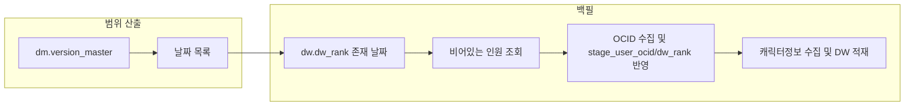

# API_KEY 전환 및 도장 랭크 전체 수집·백필 계획

## 현재 구조 요약

- **API 키**: [config.py](config.py)에서 `API_KEY_1`, `API_KEY_2`(또는 `API_KEY`) 읽고, `API_KEY2 = _clean_env("API_KEY_2") or _clean_env("API_KEY")`로 2번이 이미 API_KEY를 fallback으로 사용 중. Nexon 호출은 DAG/스크립트에서 `resolve_api_key("API_KEY_1")` 또는 `"API_KEY_2"`로 구분 사용.
- **150명 제한**: [scripts/load_ocid.py](scripts/load_ocid.py)에서 `analyze_job_distribution`으로 상위 5개 직업만 뽑고, `get_top_players_by_job(..., top_n=30)`으로 직업당 30명 = **최대 150명**만 OCID/캐릭터정보 수집 대상.
- **도장 랭커 수집**: [scripts/load_ranker.py](scripts/load_ranker.py)는 1~5페이지만 고정 조회 (`for page in range(1, 6)`).
- **version_master**: [scripts/backfill_dw_to_dm.py](scripts/backfill_dw_to_dm.py)의 `resolve_version_for_date`에서 `dm.version_master`로 (version, start_date, end_date) 조회. 백필 범위는 이 테이블에 있는 구간만 사용하면 됨.

---

## 1. .env / API_KEY 활용 (레거시 1, 2 유지)

- **config.py**
  - 주 사용 키를 `API_KEY`로 명시: `NEXON_API_KEY = _clean_env("NEXON_API_KEY") or _clean_env("API_KEY") or API_KEY2` (또는 동일 의미로 `API_KEY2` 정의 시 `API_KEY`를 우선 읽도록 유지).
  - `resolve_api_key`에 `"API_KEY"` 이름 추가: `API_KEY` 요청 시 위에서 정의한 메인 키 반환.
  - 주석 정리: API_KEY = 메인 Nexon 키, API_KEY_1/API_KEY_2 = 레거시(기존 1, 2/test).
- **.env.example**
  - `API_KEY=` 항목을 메인 Nexon API 키로 설명하고, API_KEY_1/API_KEY_2는 레거시로 명시.
- **DAG/스크립트**
  - 새로 추가된 토큰을 쓸 때 `resolve_api_key("API_KEY")`를 사용하도록 할지, 기존처럼 `API_KEY_2`만 쓸지 결정 필요. 요청이 “API_KEY를 활용”이므로 **메인 호출은 API_KEY 사용**으로 통일하는 방안 권장.  
  - [dags/maplemeta_dag.py](dags/maplemeta_dag.py): **API_KEY_2 사이클 제거**, API_KEY_1 → **API_KEY** 단일 사이클로 변경. `task_id`는 `load_ranker_api_key`, `collect_ocid_api_key` 등으로 통일.
  - [dags/load_character_info_dag.py](dags/load_character_info_dag.py): `api_key_name`을 `"API_KEY_1"` → `"API_KEY"`로 변경. `TASK_ID_MAP` 키를 `load_ranker_api_key_1` 등에서 `load_ranker_api_key` 등으로 변경.
  - [scripts/backfill_nexon_notice.py](scripts/backfill_nexon_notice.py)의 `_get_nexon_api_keys_ordered`: 1번/2번 순서 유지하되, 2번 소스에 `API_KEY` 포함되어 있음(현재 `API_KEY2`에 이미 `API_KEY` fallback 있음). 필요 시 주석만 “API_KEY 활용”으로 정리.

**결론**: config에서 `API_KEY`를 읽어 메인으로 쓰고, `resolve_api_key("API_KEY")` 지원 추가. DAG는 기존 API_KEY_1/API_KEY_2 태스크 ID는 레거시로 유지하되, **실제로 사용할 키**를 `API_KEY`에서 오도록 하려면 `op_kwargs`의 `api_key_name`을 `"API_KEY"`로 바꾸는 옵션을 고려(또는 한 사이클만 API_KEY로 전환). 사용자와 “DAG는 한 사이클만 API_KEY로 할지, 기존 2 사이클 구조 유지할지” 확인하면 좋음.

---

## 2. DAG: 도장 랭크 전체 수집

### 2-1. load_ranker — 전체 페이지 조회

- **파일**: [scripts/load_ranker.py](scripts/load_ranker.py)
- **변경**: `get_dojang_ranking_all_pages`에서 `for page in range(1, 6)` 제거. `page=1`부터 요청하고, `json_data['ranking']`이 비거나 없을 때까지 `page`를 증가시키며 반복. (기존 0.3초 sleep 유지.)
- **효과**: 루나/스카니아 서버별로 API가 주는 만큼 전부 수집 → `dw.dw_rank`에 전체 인원 적재.

### 2-2. load_ocid / load_character_info — 150명 선별 제거, 전체 대상

- **파일**: [scripts/load_ocid.py](scripts/load_ocid.py)
- **변경**:
  - `collect_user_ocid_data`에서 `analyze_job_distribution`, `get_top_players_by_job` 호출 제거.
  - `ranking_data = fetch_rank_records_for_date(conn, date)`로 가져온 **전체 리스트**를 그대로 OCID 수집 대상으로 사용 (`selected_players = ranking_data` 또는 동일 의미).
  - 직업별 30명 보충 로직(`fill_missing_players`, `job_success_count < 30` 등)은 “전체 대상”에서는 불필요하므로 제거하거나, 전체 모드일 때는 비활성화.
- **파일**: [scripts/load_character_info.py](scripts/load_character_info.py)
  - OCID 수집 결과(stage_user_ocid/페이로드)를 기준으로 캐릭터 정보 수집하므로, **OCID 대상이 전체로 바뀌면** character_info도 자동으로 전체 대상이 됨. 별도 상한 제거만 필요 시 해당 부분만 확인.

**정리**: 랭커는 전체 페이지 수집, OCID/캐릭터정보는 “상위 5직업×30명” 대신 **dw_rank 전체**를 대상으로 하도록 수정.

---

## 3. 백필: dm.version_master 범위 내 “비어 있는 인원”만 수집

### 3-1. 범위 정의

- **날짜 범위**: `dm.version_master`의 `(version, start_date, end_date)`에서 `start_date`~`end_date`(null이면 오늘까지)를 합쳐서, 백필 대상 날짜 집합을 구한다.
- **날짜별로**: `dw.dw_rank`에 해당 날짜가 존재하는 날짜만 처리.

### 3-2. “비어 있는 인원” 정의

- `dw.dw_rank`에 (date, character_name)이 있지만, 아래 중 하나라도 해당하면 “비어 있음”:
  - **OCID 미수집**: `dw.stage_user_ocid`에 (date, character_name)이 없거나, 있어도 ocid가 null/빈 값.
  - **캐릭터정보 미수집**: (date, ocid)에 대해 `dw.dw_equipment`(또는 character_info 완료 여부 판단용 테이블)에 행이 없음.  
  - 기존 [scripts/backfill_dw_to_dm.py](scripts/backfill_dw_to_dm.py)의 `_check_character_info_complete`처럼 `dw.dw_equipment`, `dw.dw_hexacore` 등 5개 테이블의 distinct ocid 수가 동일한지로 “해당 날짜 character_info 완료” 여부를 재사용할 수 있음.

### 3-3. 백필 스크립트 설계

- **새 파일**: `scripts/backfill_rank_missing_character_info.py` (별도 선호 이름 없음).
- **입력**:  
  - (옵션) `--dry-run`.  
  - 날짜 범위는 **dm.version_master에서만** 계산하므로 별도 start/end 인자는 없거나, 있으면 version_master 결과를 그 범위로 필터.
- **순서**:
  1. DB 연결, `dm.version_master` 조회 → 대상 (date, version) 목록 생성.
  2. 각 date에 대해 `dw.dw_rank` 존재 여부 확인 후, 해당 날짜의 “비어 있는 인원” 조회:
    - 랭크에 있으나 `stage_user_ocid`에 없거나 ocid 없는 캐릭터 → OCID 수집 대상.
    - OCID는 있으나 character_info(예: dw_equipment 등 5개 테이블)에 없는 (date, ocid) → 캐릭터 정보 수집 대상.
  3. OCID 수집: 기존 `load_ocid.get_character_ocid`, `upsert_stage_user_ocid` 및 `dw_rank`의 ocid 컬럼 업데이트(있는 경우) 활용.
  4. 캐릭터 정보 수집: 기존 `load_character_info.collect_character_info_data` / `load_character_info_by_endpoint`와 동일한 엔드포인트 호출 후, `dw_load_utils`의 upsert(equipment, hexacore, seteffect, ability, hyperstat) 호출.
  5. API 호출 제한 고려: 기존처럼 sleep, 실패 시 retry/queue 정책 유지. 가능하면 `config.resolve_api_key("API_KEY")` 사용.

### 3-4. dm.version_master 조회 쿼리

- `backfill_dw_to_dm.resolve_version_for_date`와 동일한 로직으로 “날짜 → version” 매핑 가능.
- “version_master에 있는 범위”만 쓰려면:
  - `SELECT version, start_date, end_date FROM dm.version_master WHERE start_date IS NOT NULL` 로 구간을 가져와서, 각 구간의 일별 날짜를 생성하면 됨. end_date가 null이면 현재 날짜까지.

---

## 4. 수정/추가 파일 요약

| 구분      | 파일                                                                                                             | 작업                                                                                |
| ------- | -------------------------------------------------------------------------------------------------------------- | --------------------------------------------------------------------------------- |
| 설정      | [config.py](config.py)                                                                                         | API_KEY 메인 사용, resolve_api_key("API_KEY") 추가, 주석 정리                               |
| 설정      | [.env.example](.env.example)                                                                                   | API_KEY 설명 추가, 레거시 1/2 설명                                                         |
| DAG 수집  | [scripts/load_ranker.py](scripts/load_ranker.py)                                                               | 1~5페이지 고정 제거, 빈 응답 나올 때까지 전체 페이지 조회                                               |
| DAG 수집  | [scripts/load_ocid.py](scripts/load_ocid.py)                                                                   | 150명 선별 제거, fetch_rank_records_for_date 결과 전체를 OCID 대상으로 사용                       |
| 백필      | **신규** `scripts/backfill_rank_missing_character_info.py`                                                       | dm.version_master 범위 내, 비어 있는 인원만 OCID + character_info 수집·적재                     |
| DAG     | [dags/maplemeta_dag.py](dags/maplemeta_dag.py)                                                                 | API_KEY_2 사이클 제거, API_KEY_1 → API_KEY 단일 사이클로 변경 (task_id: load_ranker_api_key 등) |
| DAG     | [dags/load_character_info_dag.py](dags/load_character_info_dag.py)                                             | api_key_name "API_KEY" 사용, TASK_ID_MAP을 api_key 접미사로 수정                           |
| 페이로드 권한 | [scripts/load_ocid.py](scripts/load_ocid.py), [scripts/load_character_info.py](scripts/load_character_info.py) | PAYLOAD_DIR을 환경변수로 오버라이드 가능하게 해서 PermissionError 방지 (아래 7번 참고)                    |

---

## 5. 플로우 다이어그램 (백필)

---

## 6. PAYLOAD_DIR PermissionError 대응 (기존 DAG 실패 로그 참조)

**원인**: Airflow 컨테이너에서 스크립트가 `/opt/airflow/data_json/_airflow_payloads`를 `os.makedirs(PAYLOAD_DIR, exist_ok=True)`로 생성하려다 권한 부족으로 실패.

**해결**:

- **PAYLOAD_DIR을 환경변수로 오버라이드**: `load_ocid.py`, `load_character_info.py`에서 `PAYLOAD_DIR = os.getenv("AIRFLOW_PAYLOAD_DIR") or os.getenv("PAYLOAD_DIR") or 기존경로` 적용.
- **배포**: Airflow에서 쓰기 가능 경로를 볼륨 마운트 후 `AIRFLOW_PAYLOAD_DIR` 설정.

위 내용대로 적용하면 “.env의 API_KEY 활용”, “도장 랭크 전체 수집”, “dm.version_master 범위만 백필” **확인 완료**: DAG 단일 사이클 + API_KEY만 사용, 백필 스크립트 이름 유지. API_KEY 활용·도장 전체 수집·version_master 백필·PAYLOAD_DIR 권한 해결을 모두 반영합니다.