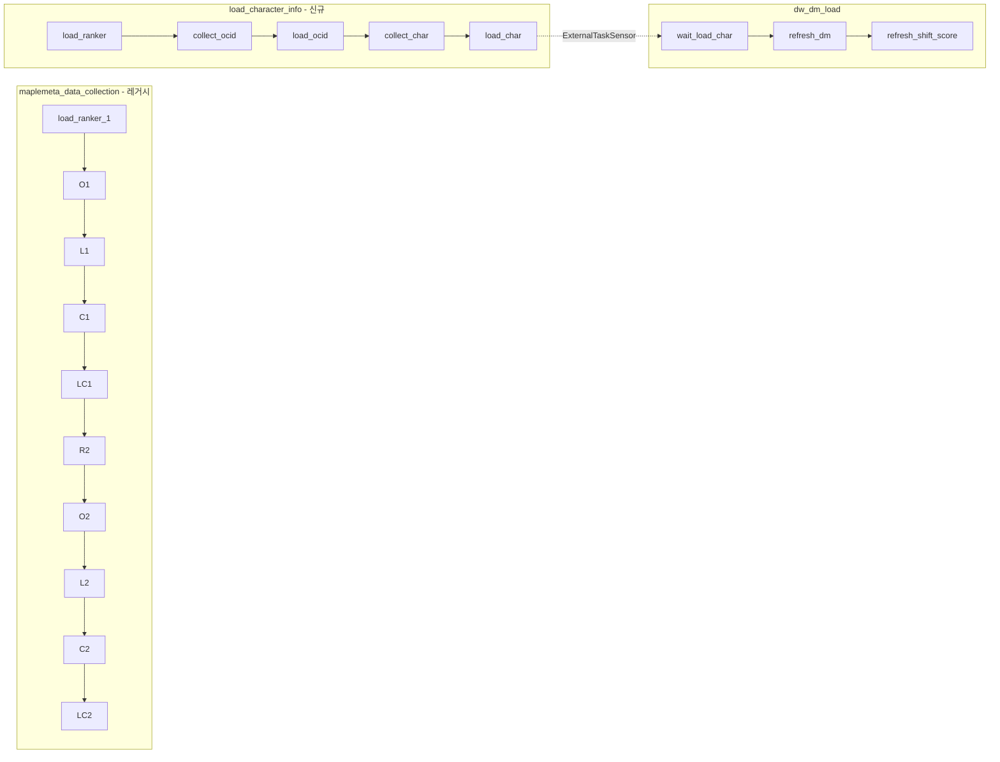

# DAG 스케줄 재구성 계획

## 현재 구조

```mermaid
flowchart LR
    subgraph maplemeta [maplemeta_data_collection]
        R1[load_ranker_1] --> O1[collect_ocid_1] --> L1[load_ocid_1] --> C1[collect_char_1] --> LC1[load_char_1]
        LC1 --> R2[load_ranker_2] --> O2[collect_ocid_2] --> L2[load_ocid_2] --> C2[collect_char_2] --> LC2[load_char_2]
    end
    subgraph dw_dm [dw_dm_load]
        SENSOR[wait_maplemeta] --> REFRESH[refresh_dm] --> SHIFT[refresh_shift_score]
    end
    LC2 -.->|ExternalTaskSensor| SENSOR
```




- **maplemeta_data_collection**: 매일 8시, API_KEY_1 + API_KEY_2 순차 2사이클
- **dw_dm_load**: 매일 8시, `load_character_info_api_key_2` 완료 대기 후 10분 sleep → DM refresh

## 목표 구조




- **maplemeta_data_collection**: 변경 없음 (레거시 유지)
- **load_character_info**: 매주 목요일 8시 KST, API_KEY_1만 1사이클
- **dw_dm_load**: 매주 목요일 8시 KST, `load_character_info` 마지막 태스크 완료 대기 후 10분 sleep → DM refresh

---

## 1. 새 DAG 파일 생성: `dags/load_character_info_dag.py`

- **DAG ID**: `load_character_info`
- **스케줄**: `"0 8 * * 4"` (매주 목요일 8시, `AIRFLOW__CORE__DEFAULT_TIMEZONE: Asia/Seoul` 적용)
- **로직**: [maplemeta_dag.py](dags/maplemeta_dag.py)의 API_KEY_1 파이프라인만 사용
  - `load_ranker` → `collect_ocid` → `load_ocid` → `collect_character_info` → `load_character_info`
- **태스크 ID**: API_KEY_1 전용이므로 `_api_key_1` 접미사 제거
  - `load_ranker`, `collect_ocid`, `load_ocid`, `collect_character_info`, `load_character_info`
- **코드 재사용**: maplemeta_dag.py의 함수들 import 후 `api_key_name='API_KEY_1'`로 호출

핵심 코드 구조:

```python
# maplemeta_dag.py와 동일한 import 및 헬퍼 함수들
# API_KEY_1 전용 태스크 5개만 정의
load_ranker >> collect_ocid >> load_ocid >> collect_character_info >> load_character_info
```

---

## 2. dw_dm_load_dag.py 수정


| 항목                  | 변경 전                              | 변경 후                                        |
| ------------------- | --------------------------------- | ------------------------------------------- |
| `schedule_interval` | `"0 8 * * *"` (매일 8시)             | `"0 8 * * 4"` (매주 목요일 8시)                   |
| `external_dag_id`   | `"maplemeta_data_collection"`     | `"load_character_info"`                     |
| `external_task_id`  | `"load_character_info_api_key_2"` | `"load_character_info"` (새 DAG의 마지막 태스크 ID) |


---

## 3. maplemeta_dag.py

- **변경 없음** (레거시 유지)
- 스케줄 `"0 8 * * *"` 유지

---

## 4. 코드 중복 처리

`load_character_info_dag.py`에서 maplemeta_dag의 로직을 재사용하는 방법:

**옵션 A (권장)**: `load_character_info_dag.py`에서 maplemeta_dag의 함수들을 import

- `from maplemeta_dag import load_ranker_task_func, load_ocid_task_func, ...`
- Airflow는 DAG 파일 간 import를 지원함

**옵션 B**: 공통 로직을 `dags/utils/` 또는 `scripts/`로 분리

- 변경 범위가 커지므로 이번 작업에서는 옵션 A로 진행

---

## 5. 파일 변경 요약


| 파일                                                                 | 작업                               |
| ------------------------------------------------------------------ | -------------------------------- |
| [dags/load_character_info_dag.py](dags/load_character_info_dag.py) | **신규 생성** - API_KEY_1 전용, 목요일 8시 |
| [dags/dw_dm_load_dag.py](dags/dw_dm_load_dag.py)                   | ExternalTaskSensor 및 schedule 수정 |
| [dags/maplemeta_dag.py](dags/maplemeta_dag.py)                     | 변경 없음                            |


