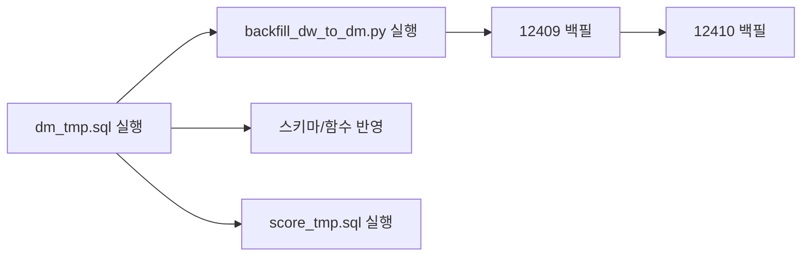

# DM 최종 검토 및 실행 계획

## 검토 결과 (문제 없음)

### 1. 스키마 ([schemas/dm_tmp.sql](schemas/dm_tmp.sql))

- `dm.character_master`에 `description`, `link_skill_icon`, `link_skill_name`, `img_full` 4개 컬럼 정의 및 `ADD COLUMN IF NOT EXISTS`로 기존 DB 호환 처리됨.
- `create table`과 `alter table`이 함께 있어, 신규/기존 환경 모두 대응 가능.

### 2. character_master 적재 로직 (동일 파일 268~410행)

- **csv_extended** CTE: [jobs_extended.csv](.cursor/docs/jobs_extended.csv)와 동일하게 46개 직업(캐논마스터→캐논슈터 매핑 반영)으로 `description`, `link_skill_icon`, `link_skill_name` 보유.
- **base** CTE: 기존 47개 행(job, group, type, img, color) 유지.
- **INSERT ... SELECT**: `base`와 `csv_extended`를 `job` 기준 LEFT JOIN 후 9개 컬럼 삽입. `img_full`은 `'/static/img/character/' || job || '.png'`로 설정.
- **ON CONFLICT (job) DO UPDATE**: 9개 컬럼 모두 갱신. idempotent 재실행 가능.

### 3. 백필 스크립트 ([scripts/backfill_dw_to_dm.py](scripts/backfill_dw_to_dm.py))

- [dm_tmp_run_guide.md](schemas/dm_tmp_run_guide.md) 규칙대로 12409(2025-12-10, 2025-12-17), 12410(2025-12-24, 2025-12-31) 각각 `dm.refresh_dashboard_dm(...)` 1회씩 호출.
- `refresh_dashboard_dm` 내부에서 character_master upsert가 수행되므로, 백필만 돌려도 character_master(신규 컬럼 포함) 적재가 함께 이루어짐.

### 4. 실행 순서 (가이드와 동일)

- **1단계**: [schemas/dm_tmp.sql](schemas/dm_tmp.sql) 전체 실행  
  - 스키마/테이블/함수 정의 갱신. 기존 DB는 ALTER로 컬럼만 추가되고, 함수는 `create or replace`로 갱신됨.
- **2단계**: [schemas/score_tmp.sql](schemas/score_tmp.sql) 실행 (스키마/함수)
- **3단계**: [scripts/backfill_dw_to_dm.py](scripts/backfill_dw_to_dm.py) 실행  
  - 12409, 12410 각각에 대해 `refresh_dashboard_dm` + `refresh_shift_balance_score` 호출 → character_master 포함 전체 DM 적재.

### 5. 실행 방법 (DB 연결 필요)

- [docker-compose.yml](docker-compose.yml)의 `DW_DATABASE_URL` 또는 로컬/Neon 등 실제 DW DB 연결 정보를 사용해 실행해야 함.
- 예: `psql "$DW_DATABASE_URL" -f schemas/dm_tmp.sql` 후 `psql "$DW_DATABASE_URL" -f schemas/score_tmp.sql` 후 `python scripts/backfill_dw_to_dm.py`

---

## 실행 시 할 일

1. **DB 연결 확인**
  - 사용할 DB가 Neon/로컬 Postgres 등 어디인지 확인하고, 해당 connection string 또는 `psql`/SQL 에디터로 접속 가능한지 확인.
2. **1단계: 스키마/함수 적용**
  - `schemas/dm_tmp.sql` 전체를 해당 DB에 실행.
  - `schemas/score_tmp.sql` 전체를 해당 DB에 실행.
3. **2단계: 백필 실행**
  - `python scripts/backfill_dw_to_dm.py` 실행.
4. **(선택) 검증**
  - [dm_tmp_run_guide.md](schemas/dm_tmp_run_guide.md) 하단 검증 SQL로 `dm_rank`, `dm_force`, `dm_hyper`, `dm_ability`, `dm_seedring`, `dm_equipment`, `hyper_master` 건수 확인.
  - `select job, description, link_skill_icon, link_skill_name, img_full from dm.character_master limit 5;` 로 신규 컬럼 적재 여부 확인.

---

## Plan 모드 제한

현재 **Plan 모드**라서 툴로 쿼리를 실제 DB에 실행할 수 없습니다. “검토까지 하고 실행까지 해줘”를 모두 수행하려면 **Agent 모드**로 전환한 뒤, 위 1~3단계를 실행하도록 요청하거나, 로컬에서 `psql`/Neon SQL 에디터로 직접 실행하면 됩니다.