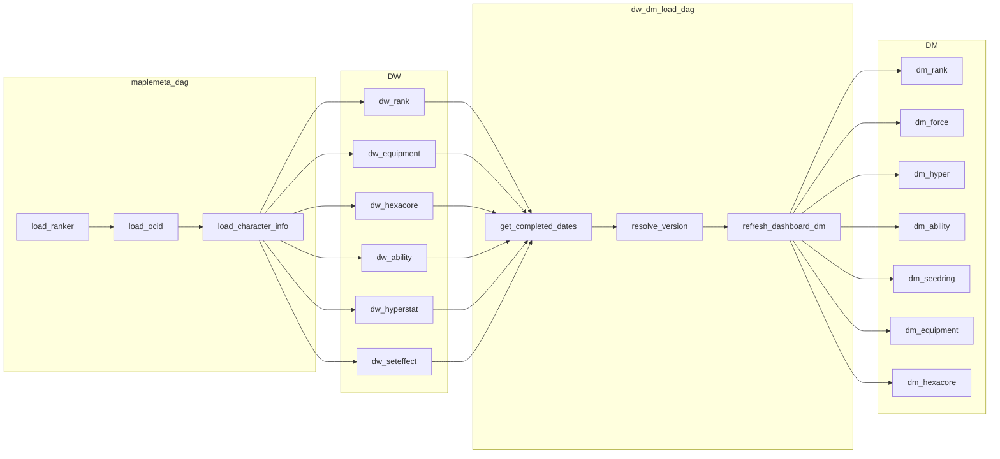

# DW → DM 적재 DAG 및 전체 백필 계획

## 현재 구조 요약

- **DW 적재**: [dags/maplemeta_dag.py](dags/maplemeta_dag.py) - `load_ranker` → `collect_ocid` → `load_ocid` → `collect_character_info` → `load_character_info`
- **DM 적재 함수**: [schemas/dm_tmp.sql](schemas/dm_tmp.sql)의 `dm.refresh_dashboard_dm(p_version, p_character_dates, p_agg_dates)`
- **버전 매핑**: [schemas/dm_tmp_run_guide.md](schemas/dm_tmp_run_guide.md) - 날짜별 버전 고정 (예: 12409→12/10,12/17 / 12410→12/24,12/31)
- **character_info 완료 조건**: [dags/maplemeta_dag.py](dags/maplemeta_dag.py) 186~210행 - `dw_equipment`, `dw_hexacore`, `dw_seteffect`, `dw_ability`, `dw_hyperstat` 5개 테이블의 distinct OCID 수가 동일

---

## 1. 전체 백필 쿼리/스크립트

**목적**: DW에 이미 적재된 모든 날짜를 한 번에 DM으로 가져오는 1회성 실행

**구성**:

- **파일**: `scripts/backfill_dw_to_dm.py` (또는 `schemas/dm_tmp_run_backfill_full.sql` + Python 래퍼)

**로직**:

1. DW에서 character_info 완료된 날짜 목록 조회
  - maplemeta_dag의 `check_data_exists('character_info')`와 동일 조건: 5개 endpoint 테이블의 distinct OCID 수가 모두 같은 날짜만
2. 날짜별 version 매핑
  - `dm.version_master` 존재 시: `start_date <= date <= coalesce(end_date, '9999-12-31')`인 version 사용
  - 없을 경우: 설정 파일 또는 fallback 규칙 (예: `dm_tmp_run_backfill.sql`의 date→version 매핑)
3. version별로 `refresh_dashboard_dm(version, date_array, date_array)` 호출

**DW 완료 날짜 조회 SQL (핵심)**:

```sql
-- character_info 완료된 날짜 = 5개 테이블 distinct OCID 수가 동일한 날짜
with t as (
    select date::date as dt from dw.dw_equipment where equipment_list = 'item_equipment'
    intersect
    select date::date from dw.dw_hexacore
    intersect
    select date::date from dw.dw_seteffect
    intersect
    select date::date from dw.dw_ability
    intersect
    select date::date from dw.dw_hyperstat
),
by_date as (
    select dt, count(distinct ocid) as c1 from dw.dw_equipment where equipment_list = 'item_equipment' and date::date = t.dt group by dt
    -- 5개 테이블 count가 모두 같은지 검증 필요
)
select distinct dt from t
order by dt;
```

단순화: `dw.dw_rank`에 있는 date 중, 5개 테이블 모두에서 해당 date에 데이터가 있고 `count(distinct ocid)`가 동일한 날짜만 필터.

```sql
select r.date
from dw.dw_rank r
where exists (select 1 from dw.dw_equipment e where e.date::date = r.date and e.equipment_list = 'item_equipment' limit 1)
  and exists (select 1 from dw.dw_hexacore h where h.date::date = r.date limit 1)
  -- ... 등
  and (select count(distinct ocid) from dw.dw_equipment where date::date = r.date and equipment_list = 'item_equipment')
    = (select count(distinct ocid) from dw.dw_hexacore where date::date = r.date)
  -- ... 5개 동일
group by r.date
order by r.date;
```

`maplemeta_dag.check_data_exists` 로직을 그대로 재사용하는 Python 함수가 더 안전함.

---

## 2. 매번 돌아가는 DAG

**파일**: [dags/dw_dm_load_dag.py](dags/dw_dm_load_dag.py) (신규)

**스케줄**: maplemeta_dag 완료 후 실행 (예: 10시, maplemeta 8시 대비 2시간 후)

**플로우**:

1. DW에서 character_info 완료된 날짜 중 최신 집계일 1개 조회 (get_reporting_date_by_policy 적용)
2. 해당 날짜의 version 결정 (`dm.version_master` 또는 config)
3. `dm.refresh_dashboard_dm(version, [date], [date])` 실행

**구현 방식**:

- `PostgresOperator`: `dm.refresh_dashboard_dm(...)` 호출 SQL만 실행
- `PythonOperator`: 날짜/version 조회 로직 + `psycopg2`로 함수 호출

PythonOperator가 날짜/version 해석 로직을 포함하므로 유리.

---

## 3. 파일별 변경 요약


| 파일                                     | 내용                                                              |
| -------------------------------------- | --------------------------------------------------------------- |
| `scripts/backfill_dw_to_dm.py`         | 신규. DW 완료 날짜 조회, version 매핑, version별 `refresh_dashboard_dm` 호출 |
| `schemas/dm_tmp_run_backfill_full.sql` | (선택) 전체 백필용 SQL 템플릿. 또는 Python 스크립트에서 동적 생성                     |
| `dags/dw_dm_load_dag.py`               | 신규. 매일 실행 DAG, 최신 완료일 기준 DM refresh                             |


---

## 4. 데이터 플로우




---

## 5. version 매핑 fallback

`dm.version_master`가 비어있을 때 (API만 사용, notice DAG 미실행):

- `dm_tmp_run_backfill.sql`의 date→version 매핑을 config로 사용
- 예: `config.DM_VERSION_RANGES = [("12409", "2025-12-10", "2025-12-23"), ("12410", "2025-12-24", None)]`
- 또는 `schemas/dm_tmp_run_backfill.sql`을 파싱해 매핑 사용

---

## 6. 의존성

- `dw_load_utils.get_dw_connection` 사용 (동일 DB)
- `dm_tmp.sql` 적용 완료 전제
- `dm.version_master`는 notice DAG 미실행 시 비어있을 수 있음 → fallback 필요

