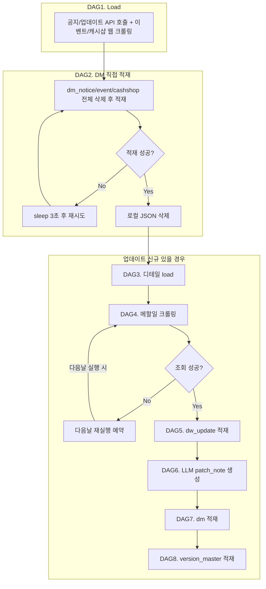

# DW/DM 추가 적재 기획안

## 0. 전제 및 수정사항

### 0.1 확정 전제

- DB 연결/샘플 스키마는 Cursor 환경에 연결됨
- `/maplestory/v1/notice-update/detail`은 notice_id당 1개 반환
- 동일 version에 notice-update 여러 건 존재 가능
- 메할일 저장: `/home/jamin/static/update/{version}_mahalil.html`
- version_master는 `dm.version_master` 단일 테이블로 운영

### 0.2 적재 경로 정정


| 구분            | DW           | DM                |
| ------------- | ------------ | ----------------- |
| 공지(notice)    | -            | 직접 적재             |
| 이벤트(event)    | -            | 직접 적재             |
| 캐시샵(cashshop) | -            | 직접 적재             |
| 업데이트(update)  | dw.dw_update | dm.version_master |


### 0.3 보안

- Claude API 키: **환경변수 `ANTHROPIC_API_KEY`** 로 관리 (소스코드/문서에 하드코딩 금지)

---

## 1. 목적/범위

**목적**: Nexon Open API + 인벤 메할일 크롤링 데이터를 DW/DM에 적재

**이번 범위 (1회성 백필)**:

- DW: `dw.dw_update` (업데이트만)
- DM: `dm_notice`, `dm_event`, `dm_cashshop` (API→직접), `dm.version_master` (dw_update 기반), `dm.dm_hexacore` (기존 dw→dm 적재 쿼리에 통합, maplemeta 일반 dm refresh 플로우)
- 인벤 메할일: version별 HTML 저장 + path 연결

**후속 제외**: Airflow DAG, patch_note LLM. 엔트로피/shift score는 대시보드에서 처리

---

## 2. 입력 소스

### 2.1 Nexon Open API (notice, update)


| API                                                  | 적재 대상     | 주요 필드                                                                    |
| ---------------------------------------------------- | --------- | ------------------------------------------------------------------------ |
| `/maplestory/v1/notice`                              | dm_notice | title, url, notice_id, date                                              |
| `/maplestory/v1/notice-update`                       | dw_update | title, url, notice_id, date, version, content, detail_path, mahalil_path |
| `/maplestory/v1/notice-update/detail?notice_id={id}` | 파일 저장     | contents → HTML                                                          |


### 2.2 이벤트/캐시샵 웹 크롤링


| URL                                                                                      | 적재 대상       | 파싱 규칙                                                                                 |
| ---------------------------------------------------------------------------------------- | ----------- | ------------------------------------------------------------------------------------- |
| [https://maplestory.nexon.com/News/Event](https://maplestory.nexon.com/News/Event)       | dm_event    | `div.event_list_wrap` → dt a img(src), dt a(href), dd.data em.event_listMt, dd.date p |
| [https://maplestory.nexon.com/News/CashShop](https://maplestory.nexon.com/News/CashShop) | dm_cashshop | `div.cash_list_wrap` → dt a img(src), dt a(href), dd.data a span, dd.date p           |


### 2.3 메할일 크롤링

- URL: `https://www.inven.co.kr/search/maple/top/{version}/1`
- 선택: "메할일" 포함 `<a>` href → 게시글 `<div class="articleMain">` outerHTML
- 저장: `/home/jamin/static/update/{version}_mahalil.html`
- **조회 실패 시**: 업데이트 직후 바로 올라오지 않으므로 당일 재시도 없이 **다음날 재실행 예약**

---

## 3. 신규 테이블 스키마

### 3.1 DW

**dw.dw_update** (신규)

```sql
create table dw.dw_update (
    notice_id integer primary key,
    title text,
    url text,
    date timestamptz,
    version text,           -- 파싱: "12411"
    content text,           -- 괄호 내부 텍스트
    detail_path text,      -- /home/jamin/static/update/{version}_{notice_id}.html
    mahalil_path text       -- /home/jamin/static/update/{version}_mahalil.html
);
```

### 3.2 DM

**dm.dm_notice**

```sql
create table dm.dm_notice (
    notice_id integer primary key,
    title text,
    url text,
    date timestamptz
);
```

**dm.dm_event**

```sql
create table dm.dm_event (
    notice_id integer primary key,
    title text,
    url text,
    date timestamptz,
    start_date timestamptz,
    end_date timestamptz,
    thumbnail text
);
```

**dm.dm_cashshop**

```sql
create table dm.dm_cashshop (
    notice_id integer primary key,
    title text,
    url text,
    date timestamptz,
    start_date timestamptz,
    end_date timestamptz,
    thumbnail text
);
```

**dm.version_master**

```sql
create table dm.version_master (
    version text primary key,
    start_date date,
    end_date date,
    type text[],            -- 캐릭터, 아이템, 스킬, 이벤트, 시스템, 기타 (PostgreSQL text[] 지원)
    impacted_job text[],    -- 직업명 배열
    patch_note text         -- {version}_patch_note.md 경로
);
```

**dm.dm_hexacore** (이번 백필에 포함, 기존 dw→dm 적재 쿼리에 통합)

```sql
create table dm.dm_hexacore (
    version text not null,
    date date not null,
    job text not null,
    segment text not null,  -- 50층 | 상위권
    hexa_core_name text not null,
    hexa_core_type text,
    count bigint not null,
    total_level bigint not null,
    primary key (version, date, job, segment, hexa_core_name)
);
```

- segment: [dm.segment_label](schemas/dm.sql) (50~69→50층, 90+ 또는 n<15이면 80+→상위권)
- count: 해당 세그먼트 내 hexa_core_name 사용 캐릭터 수
- total_level: sum(hexa_core_level)

---

## 4. 파싱 규칙

### 4.1 version

- 정규식: `(\d+)\.(\d+)\.(\d+)`
- 변환: `g1 + g2 + g3` → `"12411"` (문자열)
- 실패: version=NULL, warning 로그

### 4.2 content

- title의 `(...)` 괄호 내부 텍스트
- 괄호 없으면 NULL

### 4.3 Event/CashShop 웹 크롤링 파싱

- **Event**: `dd.data em.event_listMt` → title, `dt a` → url, `dt a img` → thumbnail, `dd.date p` → `YYYY.MM.DD ~ YYYY.MM.DD` (start_date, end_date)
- **CashShop**: `dd.data a span` (첫 span) → title, `dt a` → url, `dt a img` → thumbnail, `dd.date p` → start_date, end_date
- notice_id: url에서 `/(\d+)$` 정규식 추출

---

## 5. 파일 저장 규칙


| 유형       | 경로                           | 파일명                          |
| -------- | ---------------------------- | ---------------------------- |
| 업데이트 디테일 | `/home/jamin/static/update/` | `{version}_{notice_id}.html` |
| 메할일      | `/home/jamin/static/update/` | `{version}_mahalil.html`     |


- 디테일: API `contents` 그대로 UTF-8 저장
- 메할일: `<div class="articleMain">` outerHTML 저장

---

## 6. 적재 로직

### 6.1 detail_path / mahalil_path

- detail_path: 파일 저장 성공 후 `dw_update` upsert
- mahalil_path: version별 크롤링 성공 시 `UPDATE dw.dw_update SET mahalil_path=... WHERE version=...`
- 메할일 조회 실패 시: 당일 재시도 없이 **다음날 재실행 예약** (업데이트 직후 바로 게시되지 않는 구조)

### 6.2 dm.version_master

- 소스: `dw.dw_update`
- start_date: `MIN(date)` per version
- end_date: NULL (open-ended)
- type/impacted_job: title 기반 키워드 매칭 (캐릭터/아이템/스킬/이벤트/시스템/기타)
- patch_note: `{version}_patch_note.md` (LLM 생성 결과 경로)

### 6.3 patch_note LLM 생성

- 입력: 업데이트 디테일 HTML 전체 + 메할일 HTML
- API: Claude (환경변수 `ANTHROPIC_API_KEY`)
- 출력: 메할일 체크리스트 상단 + 메타 변화 요약 마크다운

---

## 7. DAG 순서

- dm_hexacore는 nexon notice 플로우에 포함되지 않음. maplemeta 일반 dm refresh(dm_tmp) 플로우에 포함됨.




- API 응답은 임시 JSON 보관 → DB 적재 성공 시 삭제
- DB 적재 실패 시 sleep(3) 후 재시도
- 메할일 미조회 시: 당일 재시도 없이 다음날 재실행 예약

---

## 8. 참고: 기존 DB 구조

- [schemas/dw.sql](schemas/dw.sql): dw_rank, dw_ability, dw_hexacore, dw_equipment, dw_hyperstat 등
- [schemas/dm.sql](schemas/dm.sql): dm_rank, dm_force, dm_hyper, dm_ability, dm_seedring, dm_equipment, dm.segment_label
- 정적 파일(detail, mahalil, patch_note): `~/static/update/` (STATIC_HOST_DIR)
- dw/dm CSV 샘플: schemas 등 참조

---

## 9. 수정/보완 사항 (원본 대비)


| 항목                    | 수정 내용                                             |
| --------------------- | ------------------------------------------------- |
| API 키                 | 하드코딩 제거, `ANTHROPIC_API_KEY` 환경변수 명시              |
| notice/event/cashshop | DW 없이 DM 직접 적재로 정정                                |
| impacted_job          | 오타 "impected_job" → "impacted_job"                |
| hexa_core_name        | 오타 "hexaa_core_name" → "hexa_core_name"           |
| version 파싱            | `title.slice()[1]` → 정규식 `(\d+)\.(\d+)\.(\d+)` 명시 |
| content 파싱            | `title.slice("(")[:-1]` → 괄호 내부 텍스트 추출로 명확화       |


