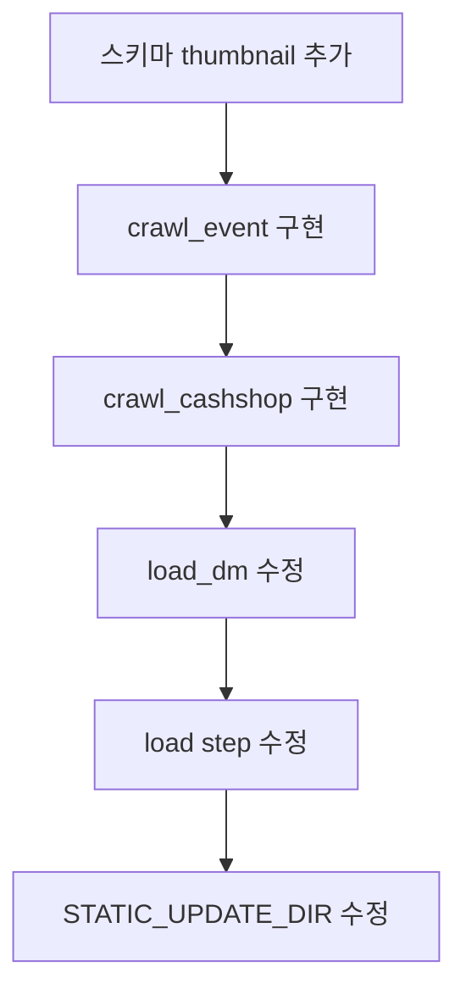

# Nexon 적재 방식 변경 계획

## 1. 변경 요약


| 구분       | 기존  | 변경                                             |
| -------- | --- | ---------------------------------------------- |
| notice   | API | API 유지                                         |
| update   | API | API 유지                                         |
| event    | API | **웹 크롤링** (maplestory.nexon.com/News/Event)    |
| cashshop | API | **웹 크롤링** (maplestory.nexon.com/News/CashShop) |


---

## 2. 스키마 변경

### 2.1 dm_event, dm_cashshop에 thumbnail 컬럼 추가

- [schemas/dm.sql](schemas/dm.sql): `dm_event`, `dm_cashshop`에 `thumbnail text` 추가
- [scripts/backfill_nexon_notice.py](scripts/backfill_nexon_notice.py) 내 `_ensure_dm_schema()` DDL도 동일하게 수정

```sql
-- dm_event
alter table dm.dm_event add column if not exists thumbnail text;

-- dm_cashshop  
alter table dm.dm_cashshop add column if not exists thumbnail text;
```

---

## 3. 이벤트/캐시샵 웹 크롤링 구현

### 3.1 Event 페이지 파싱

- URL: `https://maplestory.nexon.com/News/Event`
- HTML 구조: `<li>` 내 `<div class="event_list_wrap">` → `<dl>`


| 필드                   | 선택자                       | 예시                           |
| -------------------- | ------------------------- | ---------------------------- |
| thumbnail            | `dt a img` → `src`        | `https://file.nexon.com/...` |
| url                  | `dt a` → `href`           | `/News/Event/Ongoing/1283`   |
| notice_id            | url에서 `/(\d+)$` 추출        | `1283`                       |
| title                | `dd.data em.event_listMt` | 스페셜 썬데이 메이플                  |
| start_date, end_date | `dd.date p`               | `2026.03.01 ~ 2026.03.01`    |


- date: `start_date`와 동일 (또는 start_date 기준)

### 3.2 CashShop 페이지 파싱

- URL: `https://maplestory.nexon.com/News/CashShop`
- HTML 구조: `<div class="cash_list_wrap">` → `<dl>`


| 필드                   | 선택자                | 예시                            |
| -------------------- | ------------------ | ----------------------------- |
| thumbnail            | `dt a img` → `src` | `https://file.nexon.com/...`  |
| url                  | `dt a` → `href`    | `/News/CashShop/Sale/603`     |
| notice_id            | url에서 `/(\d+)$` 추출 | `603`                         |
| title                | `dd.data a span`   | `2월 12일 캐시아이템 업데이트` (첫 span만) |
| start_date, end_date | `dd.date p`        | `2026.02.12 ~ 2026.03.18`     |


- CashShop title: `<a>` 내 `<span>` text (다른 텍스트는 제외 가능). `dd.data p a span` 또는 첫 번째 span 사용

### 3.3 날짜 파싱

- `dd.date` 형식: `YYYY.MM.DD ~ YYYY.MM.DD`
- 정규식: `(\d{4})\.(\d{2})\.(\d{2})\s*~\s*(\d{4})\.(\d{2})\.(\d{2})` → start_date, end_date

### 3.4 URL 정규화

- 상대 경로: `/News/Event/Ongoing/1283` → `https://maplestory.nexon.com/News/Event/Ongoing/1283`

### 3.5 의존성

- `requests` + `BeautifulSoup4` (bs4) 또는 `html.parser`로 파싱
- [requirements.txt](requirements.txt)에 `beautifulsoup4` 추가 (없을 경우)

---

## 4. backfill_nexon_notice.py 수정

### 4.1 load_event() → crawl_event()

- `load_event()`: API 호출 제거 → `crawl_event()`: 웹 페이지 크롤링
- 반환 형식: `{notice_id, title, url, date, start_date, end_date, thumbnail}`

### 4.2 load_cashshop() → crawl_cashshop()

- 동일하게 `crawl_cashshop()` 구현

### 4.3 _load_dm_event(conn, rows), _load_dm_cashshop(conn, rows)

- `thumbnail` 컬럼 추가하여 insert/upsert

### 4.4 _run_step_load()

- `event_rows = crawl_event()` (기존 `load_event()` 대체)
- `cashshop_rows = crawl_cashshop()` (기존 `load_cashshop()` 대체)

---

## 5. detail 에러 (STATIC_UPDATE_DIR) 수정

### 5.1 원인

- `.env`에 `STATIC_UPDATE_DIR=/home/jamin/static/update` 설정 시 Airflow 컨테이너에서 해당 경로 사용
- 컨테이너 내 `/home/jamin` 없음 → `PermissionError` 발생

### 5.2 해결

- [docker-compose.yml](docker-compose.yml): `STATIC_UPDATE_DIR`를 컨테이너용 절대 경로로 강제 설정

```yaml
# 기존
STATIC_UPDATE_DIR: ${STATIC_UPDATE_DIR:-/opt/airflow/static/update}

# 변경: docker 환경에서는 항상 /opt/airflow/static/update 사용
STATIC_UPDATE_DIR: /opt/airflow/static/update
```

- 또는 `.env`에서 `STATIC_UPDATE_DIR` 제거 시 docker-compose 기본값 사용
- [.env.example](.env.example): docker 사용 시 `STATIC_UPDATE_DIR` 설정하지 않도록 주석 보강

```env
# STATIC_UPDATE_DIR: 로컬 실행 시에만 설정 (docker는 /opt/airflow/static/update 사용, .env에 설정하지 말 것)
# STATIC_UPDATE_DIR=/home/jamin/static/update
```

### 5.3 volume 확인

- `./static:/opt/airflow/static` 마운트가 이미 있음 → `/opt/airflow/static/update` 생성 가능

---

## 6. 기획안 문서 업데이트

- [.cursor/plans/dw_dm_추가적재_기획안_1e65cabf.plan.md](.cursor/plans/dw_dm_추가적재_기획안_1e65cabf.plan.md)
  - 섹션 2.1 입력 소스: event/cashshop를 API → 웹 크롤링으로 변경
  - dm_event, dm_cashshop 스키마에 thumbnail 추가
  - 파싱 규칙: Event/CashShop HTML 선택자 명시

---

## 7. 구현 순서




---

## 8. 파일 변경 목록


| 파일                                              | 변경 내용                                                                                                                                 |
| ----------------------------------------------- | ------------------------------------------------------------------------------------------------------------------------------------- |
| `schemas/dm.sql`                                | dm_event, dm_cashshop에 thumbnail 컬럼 추가                                                                                                |
| `scripts/backfill_nexon_notice.py`              | crawl_event, crawl_cashshop 구현, load_event/load_cashshop 대체, _ensure_dm_schema DDL 수정, _load_dm_event/_load_dm_cashshop에 thumbnail 반영 |
| `requirements.txt`                              | beautifulsoup4 추가 (없을 경우)                                                                                                             |
| `docker-compose.yml`                            | STATIC_UPDATE_DIR를 /opt/airflow/static/update로 고정                                                                                     |
| `.env.example`                                  | STATIC_UPDATE_DIR 주석 보강                                                                                                               |
| `.cursor/plans/dw_dm_추가적재_기획안_1e65cabf.plan.md` | 입력 소스 변경, 스키마/파싱 규칙 반영                                                                                                                |


