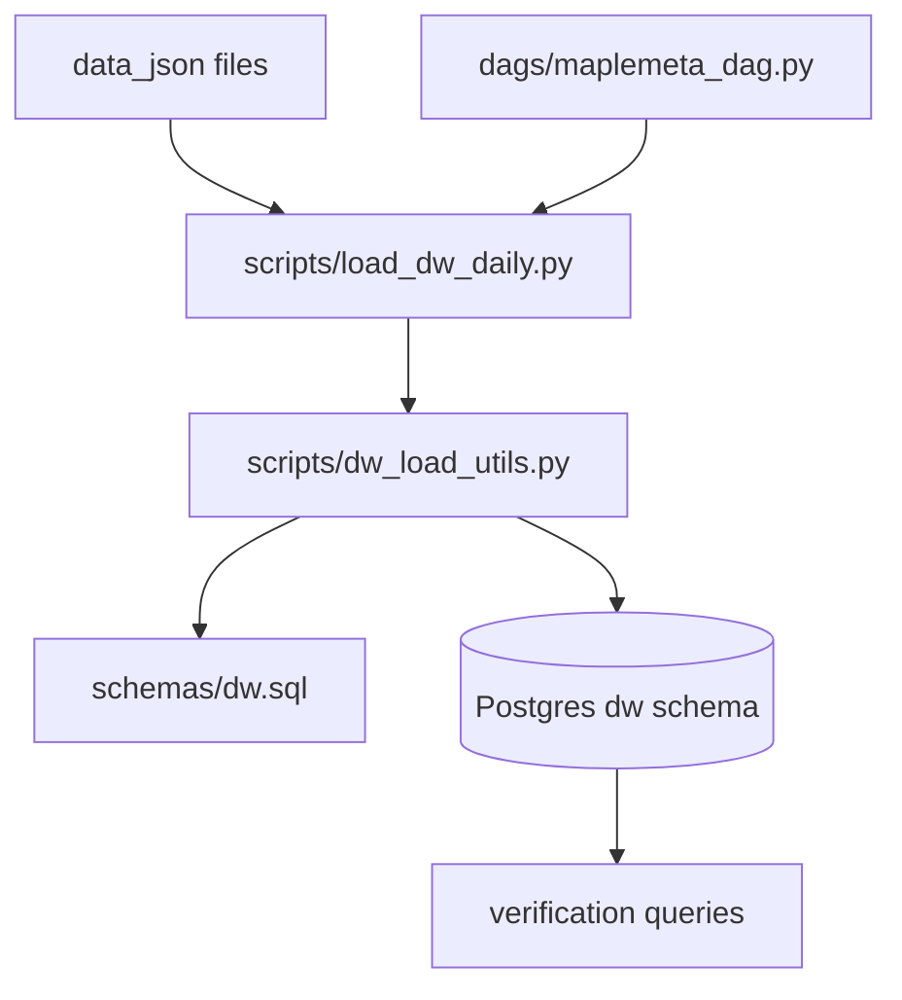

# Postgres DW 구축 및 DAG 최종단 검증 계획

## 목표

- 로컬 Docker Postgres에 DW 스키마를 구축하고, `data_json` 데이터를 DW 테이블로 적재 가능하게 만든다.
- DAG 마지막 단계(`load_dw`)가 실패 없이 실행되고, 적재 결과를 검증할 수 있도록 한다.

## 기준/가정

- 스키마 기준: `.cursor/docs`의 `DW 필드정의서-*.csv`를 `DW 필드정의서.xlsx`의 추출본으로 간주.
- 실행 환경: 로컬 Docker (`docker compose`) 기준.
- DW는 기존 Airflow Postgres 인스턴스 내 `dw` 스키마로 운영(별도 DB 분리 없이 최소 변경 우선).

## 구현 단계

1. **DW 스키마 정합성 확정**

- `[schemas/dw.sql](/home/jamin/Workspace/maplemeta/schemas/dw.sql)`을 CSV 필드 정의와 1:1 대조.
- 테이블별 컬럼 타입/PK/인덱스 차이(예: `date` 타입 일관성, boolean/text 혼용) 정리 후 SQL 반영.
- 핵심 참조 파일:
  - `[.cursor/docs/DW 필드정의서-overview.csv](/home/jamin/Workspace/maplemeta/.cursor/docs/DW%20필드정의서-overview.csv)`
  - `[.cursor/docs/DW 필드정의서-rank.csv](/home/jamin/Workspace/maplemeta/.cursor/docs/DW%20필드정의서-rank.csv)`
  - `[.cursor/docs/DW 필드정의서-ability.csv](/home/jamin/Workspace/maplemeta/.cursor/docs/DW%20필드정의서-ability.csv)`
  - `[.cursor/docs/DW 필드정의서-equipment.csv](/home/jamin/Workspace/maplemeta/.cursor/docs/DW%20필드정의서-equipment.csv)`
  - `[.cursor/docs/DW 필드정의서-hexacore.csv](/home/jamin/Workspace/maplemeta/.cursor/docs/DW%20필드정의서-hexacore.csv)`
  - `[.cursor/docs/DW 필드정의서-seteffect.csv](/home/jamin/Workspace/maplemeta/.cursor/docs/DW%20필드정의서-seteffect.csv)`
  - `[.cursor/docs/DW 필드정의서-hyperstat.csv](/home/jamin/Workspace/maplemeta/.cursor/docs/DW%20필드정의서-hyperstat.csv)`

1. **적재 로직 안정화(스키마 맞춤)**

- `[scripts/dw_load_utils.py](/home/jamin/Workspace/maplemeta/scripts/dw_load_utils.py)`에서 파싱/업서트 타입 불일치 방지:
  - timestamp/date 정규화
  - boolean 컬럼 파싱 일관화
  - JSONB 컬럼 직렬화 검증
- `[scripts/load_dw_daily.py](/home/jamin/Workspace/maplemeta/scripts/load_dw_daily.py)`에서 파일 누락/빈 데이터/예외 시 로그 명확화 및 실패 전파 정책 정리.

1. **로컬 Docker Postgres 연결 경로 확정**

- `[docker-compose.yml](/home/jamin/Workspace/maplemeta/docker-compose.yml)` 및 `[.env.example](/home/jamin/Workspace/maplemeta/.env.example)` 기준으로 DW 접속값을 로컬 실행 가능 상태로 정리.
- Airflow 컨테이너에서 `DW_DATABASE_URL`이 해석되도록 실행 가이드 보완.

1. **DAG 마지막 단계 검증 가능성 강화**

- `[dags/maplemeta_dag.py](/home/jamin/Workspace/maplemeta/dags/maplemeta_dag.py)`의 `load_dw_task_func` 검증 포인트 보강:
  - 대상 집계일 출력
  - 적재 성공/실패 시그널 명확화
  - 실패 시 task fail 보장
- `load_dw` 이후 SQL 검증 쿼리(테이블별 count, 최신 date, PK 중복 여부)를 표준 체크리스트로 문서화.

1. **실행 검증 시나리오 작성 및 리허설**

- 단건 날짜(`--date`) 직접 적재 검증
- DAG 전체 실행 후 마지막 task(`load_dw`) 성공 및 데이터 적재 결과 확인
- 검증 결과를 재현 가능한 커맨드/체크리스트로 문서화

## 완료 기준(Definition of Done)

- `dw` 스키마와 6개 DW 테이블이 로컬 Postgres에 생성된다.
- 지정 집계일에 대해 `load_dw_for_date()` 실행 시 테이블별 upsert가 완료된다.
- DAG 실행에서 `load_dw` task가 성공 상태이며, 검증 SQL 결과가 기대 범위를 만족한다.
- 실행/검증 절차가 문서화되어 재실행 가능하다.
