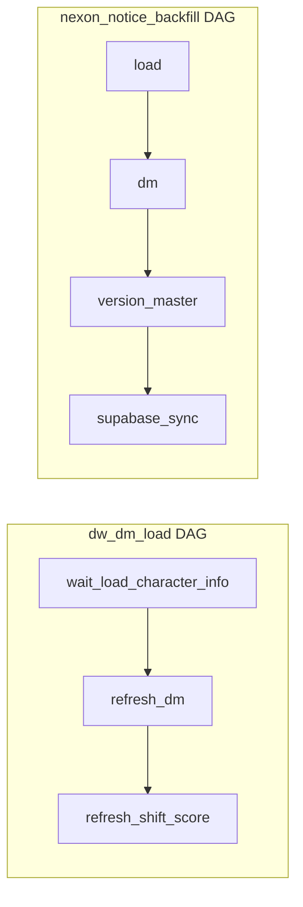

# 260307_Supabase DM 테이블 리셋 및 DAG 싱크 계획

## 현재 구조




- **dw_dm_load**: `refresh_dm` → `refresh_shift_score` (Supabase 싱크 없음)
- **nexon_notice**: 이미 `supabase_sync` 포함 (version_master, SMALL_TABLES, VERSIONED_TABLES 증분)

---

## 1. Supabase 리셋 및 재적재 스크립트

**신규 파일**: [scripts/reset_supabase_dm_tables.py](scripts/reset_supabase_dm_tables.py)

**대상 테이블** (리셋 후 로컬 dm에서 전체 재적재):

- `dm_ability`, `dm_balance_score`, `dm_equipment`, `dm_force`, `dm_hexacore`, `dm_hyper`, `dm_rank`, `dm_shift_score`
- `equipment_master`, `hyper_master`

**수정 제외** (스크립트에서 건드리지 않음):

- `character_master`, `dm_cashshop`, `dm_event`, `dm_notice`, `dm_update`, `version_master`

**구현 요약**:

- [sync_supabase.py](scripts/sync_supabase.py)의 `_get_local_conn`, `_rows_to_dicts`, `_serialize`, `_sb_insert_batch` 재사용
- `sync_small_table`과 동일한 delete 패턴: `first_col` 기준 `gte.0`, `lt.0`, `neq.IMPOSSIBLE_PLACEHOLDER_XYZ_999`로 Supabase 전체 삭제
- versioned 테이블: 로컬 `dm.{table}` 전체 SELECT 후 Supabase에 batch insert
- `equipment_master`, `hyper_master`: 동일 full replace 로직
- 실행: `python scripts/reset_supabase_dm_tables.py`

---

## 2. sync_supabase.py 확장 (DAG용 dm 전용 싱크)

**목적**: dw_dm_load DAG에서 dm 적재 완료 후 Supabase에만 반영 (version_master, notice 등은 건드리지 않음)

**추가 함수**: `run_sync_dm_tables(version: str | None = None)`

- `version`: `refresh_dm` XCom에서 전달. `None`이면 `version_master`에서 로컬 전체 버전 조회
- **equipment_master**, **hyper_master**: full replace (sync_small_table과 동일)
- **VERSIONED_TABLES** (`dm_ability`, `dm_balance_score`, `dm_equipment`, `dm_force`, `dm_hexacore`, `dm_hyper`, `dm_rank`, `dm_seedring`, `dm_shift_score`):
  - Supabase에서 해당 version 행 삭제 후 로컬 데이터 insert
  - `sync_versioned_table_replace(conn, table, version)` 신규: delete by version + insert

**sync_versioned_table_replace**:

- PostgREST: `DELETE /rest/v1/{table}?version=eq.{version}`
- 로컬 `SELECT * FROM dm.{table} WHERE version = %s` 후 batch insert

---

## 3. dw_dm_load DAG 수정

**파일**: [dags/dw_dm_load_dag.py](dags/dw_dm_load_dag.py)

**변경**:

- `sync_supabase.run_sync_dm_tables` import
- `supabase_sync` PythonOperator 추가: `refresh_shift_score` 이후 실행
- `run_sync_dm_tables`에 `version` 전달: `ti.xcom_pull(task_ids="refresh_dm")` 사용

```python
# 의존성
wait_load_character_info >> refresh_dm >> refresh_shift_score >> supabase_sync
```

---

## 4. nexon_notice DAG

**현재**: `version_master_task >> supabase_sync_task` 이미 존재

**변경**: 없음. `run_sync()`가 version_master, SMALL_TABLES, VERSIONED_TABLES(증분)를 처리하므로 그대로 유지.

---

## 5. sync_supabase.py 테이블 목록 정리

**equipment_master**, **hyper_master**를 DAG 싱크에 포함:

- `DM_FULL_SYNC_TABLES`: `["equipment_master", "hyper_master"]` (run_sync_dm_tables에서 full replace)
- `run_sync_dm_tables`에서 VERSIONED_TABLES + DM_FULL_SYNC_TABLES 처리

---

## 파일 변경 요약


| 파일                                    | 작업                                                      |
| ------------------------------------- | ------------------------------------------------------- |
| `scripts/reset_supabase_dm_tables.py` | 신규 생성                                                   |
| `scripts/sync_supabase.py`            | `run_sync_dm_tables`, `sync_versioned_table_replace` 추가 |
| `dags/dw_dm_load_dag.py`              | `supabase_sync` 태스크 추가                                  |


---

## 보안

- [sync_supabase.py 34-39행](scripts/sync_supabase.py): 하드코드된 `SUPABASE_KEY` fallback 제거 권장 (환경변수만 사용)

---

## 완료 사항

### **1. scripts/reset_supabase_dm_[tables.py](http://tables.py) 추가**

- 대상 테이블: dm_ability, dm_balance_score, dm_equipment, dm_force, dm_hexacore, dm_hyper, dm_rank, dm_shift_score, equipment_master, hyper_master
- Supabase 전체 삭제 후 로컬 dm에서 전체 재적재
- 실행: python3 scripts/reset_supabase_dm_[tables.py](http://tables.py)

### **2. scripts/sync_[supabase.py](http://supabase.py) 수정**

- run_sync_dm_tables(version): dw_dm_load DAG용 dm 전용 싱크
- sync_versioned_table_replace(): 특정 version 삭제 후 재적재
- DM_FULL_SYNC_TABLES: equipment_master, hyper_master
- 하드코드된 SUPABASE_KEY 제거 → SUPABASE_SERVICE_KEY 또는 SUPABASE_SERVICE_ROLE_KEY 환경 변수만 사용
- run_sync, run_sync_dm_tables에서 키 미설정 시 명확한 에러 메시지 출력

### **3. dags/dw_dm_load_[dag.py](http://dag.py) 수정**

- supabase_sync 태스크 추가: refresh_shift_score 이후 실행
- refresh_dm XCom에서 version을 받아 run_sync_dm_tables 호출

### **4. .env.example 수정**

- Supabase 관련 변수 설명 추가:
- SUPABASE_URL
- SUPABASE_SERVICE_KEY 또는 SUPABASE_SERVICE_ROLE_KEY

.env에 SUPABASE_SERVICE_KEY 또는 SUPABASE_SERVICE_ROLE_KEY가 없으면 Supabase 관련 스크립트 실행 시 에러가 발생합니다. .env.example을 참고해 .env에 값을 설정하면 됩니다.