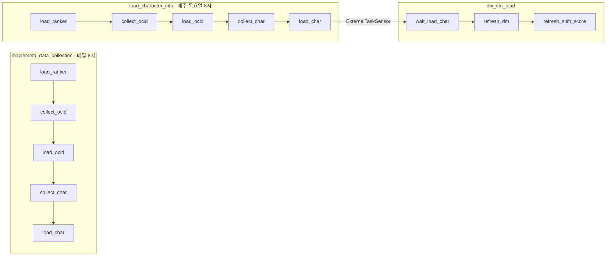

# Maplemeta

메이플스토리 메타 분석을 위한 데이터 수집·적재 파이프라인. Nexon Open API와 무릉도장 랭킹 데이터를 기반으로 DW(Data Warehouse) → DM(Data Mart) 적재를 수행한다.

## 주요 기능

- **데이터 수집**: 무릉도장 랭킹 → OCID → 캐릭터 정보(장비, 헥사코어, 세트효과, 어빌리티, 하이퍼스탯)
- **DW 적재**: 수집 데이터를 `dw` 스키마에 저장
- **DM 적재**: DW를 집계하여 대시보드용 `dm` 스키마로 변환
- **Shift Score / 밸런스 점수**: 직업별 메타 변화 추적 지표 (Outcome, Stat, Build)
- **Nexon 공지**: 공지·업데이트·이벤트·캐시샵 수집 및 DM 적재

## 프로젝트 구조

```
maplemeta/
├── dags/                    # Airflow DAG 정의
│   ├── maplemeta_dag.py      # 매일 8시, API_KEY 단일 사이클
│   ├── load_character_info_dag.py  # 매주 목요일 8시, API_KEY 전용
│   ├── dw_dm_load_dag.py     # DW→DM 적재 (load_character_info 완료 10분 후)
│   └── nexon_notice_dag.py   # Nexon 공지/업데이트/이벤트/캐시샵
├── schemas/                  # DB 스키마 및 ETL 함수
│   ├── dw.sql               # DW 스키마
│   ├── dm_tmp.sql           # DM 스키마 + refresh_dashboard_dm
│   ├── score_tmp.sql        # shift_score, balance_score ETL
│   └── dm_tmp_run_guide.md  # 실행 가이드
├── scripts/                  # 수집·적재 로직
│   ├── load_ranker.py        # 무릉도장 랭킹 수집
│   ├── load_ocid.py          # OCID 수집·적재
│   ├── load_character_info.py # 캐릭터 정보 수집·적재
│   ├── backfill_dw_to_dm.py  # DW→DM 전체 백필
│   ├── backfill_rank_missing_character_info.py  # DW만: version_master 범위 내 비어 있는 인원 OCID·character_info 백필
│   ├── backfill_nexon_notice.py # Nexon 공지 백필
│   └── dw_load_utils.py      # DW 연결·스키마 유틸
├── config.py                 # 환경 변수 (API_KEY 등)
├── docker-compose.yml        # Airflow + PostgreSQL
├── requirements.txt
└── .env.example              # 환경 변수 템플릿
```

## 환경 설정

### 1. 환경 변수

`.env.example`을 복사하여 `.env` 생성 후 필요한 환경 변수 설정:

```bash
cp .env.example .env
```

| 변수 | 설명 |
|------|------|
| `API_KEY` | 메인 Nexon API 키 (수집·백필 공통) |
| `API_KEY_1`, `API_KEY_2` | 레거시 (선택) |
| `NEXON_API_KEY` | Nexon 공지 API (없으면 API_KEY 사용) |
| `ANTHROPIC_API_KEY` | patch_note LLM 생성용 |
| `DW_DATABASE_URL` | PostgreSQL 연결 문자열 |
| `AIRFLOW_PAYLOAD_DIR` | Airflow에서 페이로드 저장 경로 (권한 오류 시 설정) |

### 2. Docker 실행

```bash
docker compose up -d
```

- Airflow UI: http://localhost:8080
- 기본 계정: `airflow` / `airflow`

### 3. 스키마 적용 (최초 1회)

```bash
# DM 스키마
psql "$DW_DATABASE_URL" -v ON_ERROR_STOP=1 -f schemas/dm_tmp.sql

# Shift/Balance 점수 함수
psql "$DW_DATABASE_URL" -v ON_ERROR_STOP=1 -f schemas/score_tmp.sql
```

## DAG 플로우



| DAG | 스케줄 | 설명 |
|-----|--------|------|
| `maplemeta_data_collection` | 매일 8시 | API_KEY 단일 사이클 백필 |
| `load_character_info` | 매주 목요일 8시 | API_KEY 전용 수집 |
| `dw_dm_load` | 매주 목요일 8시 | load_character_info 완료 10분 후 DM refresh |
| `nexon_notice_backfill` | 매일 9시 | 공지·업데이트·이벤트·캐시샵 |

## 백필

### DW만 (OCID·character_info)

```bash
# dm.version_master 범위 내, 비어 있는 인원만 수집·DW 적재 (DM refresh 없음)
python3 scripts/backfill_rank_missing_character_info.py
python3 scripts/backfill_rank_missing_character_info.py --dry-run   # 대상만 출력
```

### DW → DM

```bash
# 기본: character_info 완료된 날짜만 적재 (5개 테이블 OCID 수 동일한 날짜)
python3 scripts/backfill_dw_to_dm.py

# --force: 완료 체크 생략, dw_rank에 있는 모든 날짜 적재 (하위권 등 OCID 수 불일치 시)
python3 scripts/backfill_dw_to_dm.py --force

# --full-reset: DM 테이블 전체 truncate 후 DW 기준으로 재적재 (DW 클렌징 후 사용)
python3 scripts/backfill_dw_to_dm.py --full-reset

# --shift-score-only: shift_score·balance_score만 백필 (dm.dm_rank 기준 version)
python3 scripts/backfill_dw_to_dm.py --shift-score-only
```

| 옵션 | 설명 |
|------|------|
| (없음) | 5개 character_info 테이블 OCID 수가 동일한 날짜만 DM 적재 |
| `--force` | 완료 체크 생략. dw_rank 날짜 전체 적재 (하위권·셋팅 미구성 캐릭터는 NULL) |
| `--full-reset` | dm_rank, dm_force, dm_hyper 등 11개 테이블 truncate 후 `--force` 모드로 재적재 (character_master 제외) |
| `--shift-score-only` | dm.dm_rank에 있는 version에 대해 shift_score·balance_score만 재계산 |

## 세그먼트 정의

| segment | 조건 |
|---------|------|
| 50층 | floor 50~69 |
| 상위권 | floor ≥ 90 (해당 date+job에서 90층 이상 < 15명이면 floor ≥ 80) |
| total | 0.7 × 50층 점수 + 0.3 × 상위권 점수 |

---

## 변경 히스토리

> 파일 생성일·커밋 기준. 내용의 날짜(예: 12409, 12/10)는 데이터/버전 기준일.

### 2026-03-06
- **API_KEY 전환**: 메인 키를 `API_KEY`로 통일, `API_KEY_1`/`API_KEY_2`는 레거시로 유지
- **DAG 단일 사이클**: maplemeta_dag·load_character_info_dag 모두 API_KEY 하나만 사용 (task_id: `load_ranker_api_key` 등)
- **도장 랭크 전체 수집**: load_ranker는 1~5페이지 고정 제거, 빈 응답 나올 때까지 전체 페이지 조회; load_ocid는 150명 선별 제거, dw_rank 전체를 OCID·character_info 대상으로 사용
- **백필 스크립트 추가**: `backfill_rank_missing_character_info.py` — dm.version_master 범위 내, dw_rank에 있으나 OCID/character_info가 비어 있는 인원만 수집·**DW 적재만** 수행 (DM refresh 없음)
- **PAYLOAD_DIR 권한 대응**: `AIRFLOW_PAYLOAD_DIR`/`PAYLOAD_DIR` 환경 변수로 페이로드 경로 오버라이드 가능 (PermissionError 방지)

### 2026-03-03
- **DAG 스케줄 재구성**: `load_character_info` 신규 생성 (매주 목요일 8시, API_KEY_1 전용)
- **dw_dm_load**: 의존성 `maplemeta_data_collection` → `load_character_info`로 변경

### 2026-03-02
- **shift_score / 엔트로피 DB 적재**: `dm_shift_score`, `dm_balance_score`, `score_tmp.sql` ETL
- **dm 검토 및 실행**: character_master 확장, 백필 순서
- **dw-dm 적재 DAG**: backfill_dw_to_dm, refresh_dashboard_dm
- **260225 집계 변경**: date+count, dm_hyper, hyper_master

### 2026-03-01
- **260301 shift/추가적재**: shift_score 집계 공식, dw_dm 추가적재 계획
- **Nexon 적재 방식 변경**: event/cashshop API → 웹 크롤링 전환 계획

### 2026-02-25
- **dm_tmp_run_guide**: 집계 기준 date+count, dm_hyper, 세트효과 제외, 버전별 날짜 고정
- **260224 dw-dm-init-backfill**: DW→DM 초기 백필 계획

### 2026-02-24
- **dw>>dm query**: add dw >> dm query, clean dm sql

### 2026-02-20
- **수집/적재 분리**: OCID, character_info collect/load 분리, 페이로드 파일 저장
- **적재 재시도**: `_run_with_backoff()` 지수 백오프
- **collect-load-split-retry**: 적재 큐 SQL 버그 수정

### 2026-02-19
- **postgresDB DW**: DW 스키마 Postgres 전환
- **data mart query**: dm 스키마 및 refresh_dashboard_dm
- **dw-to-dm-dec2025**: 12월 데이터(12409, 12410) 기준 DW→DM 계획

### 2026-01-30 ~ 2026-01-31
- **DW 스키마**: dw.sql 추가
- **Airflow DAG**: maplemeta_dag, load_ranker→load_ocid→load_character_info

### 2026-01-28
- **Docker Airflow**: docker-compose, airflow DAG 초기 구성
